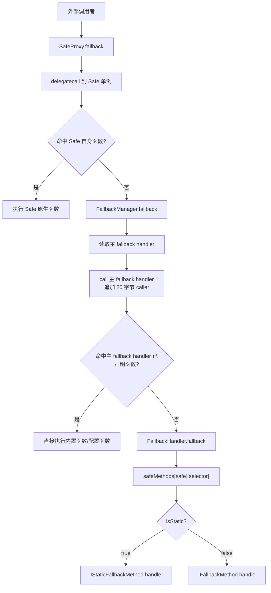
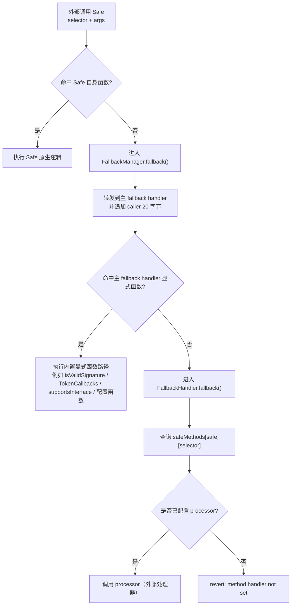
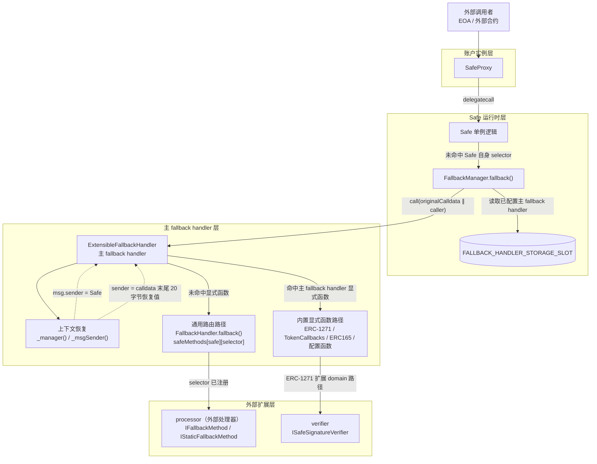
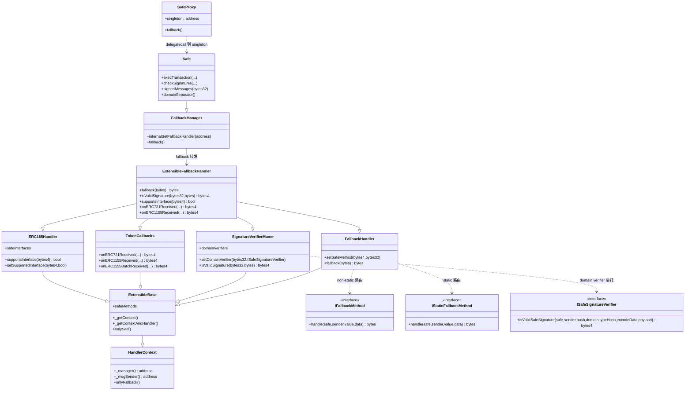
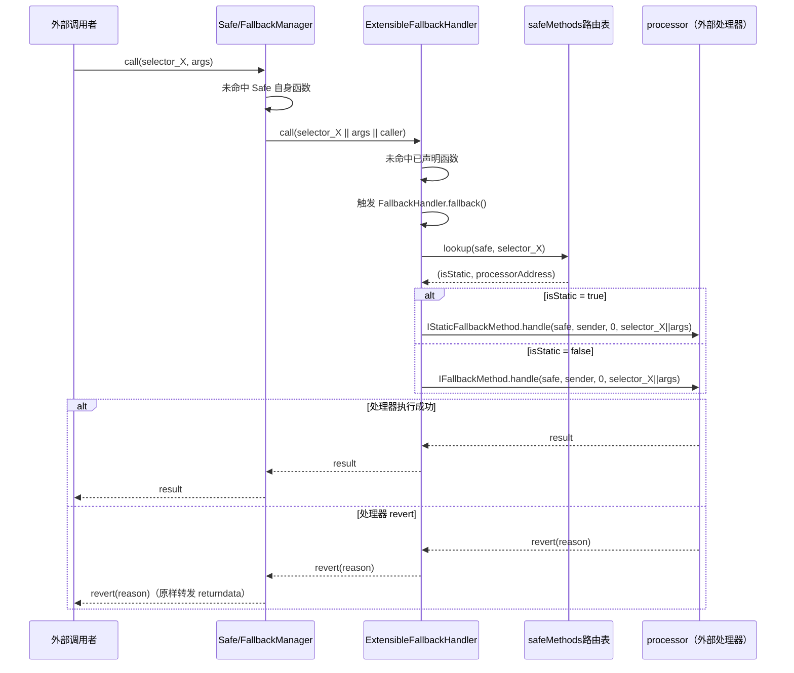
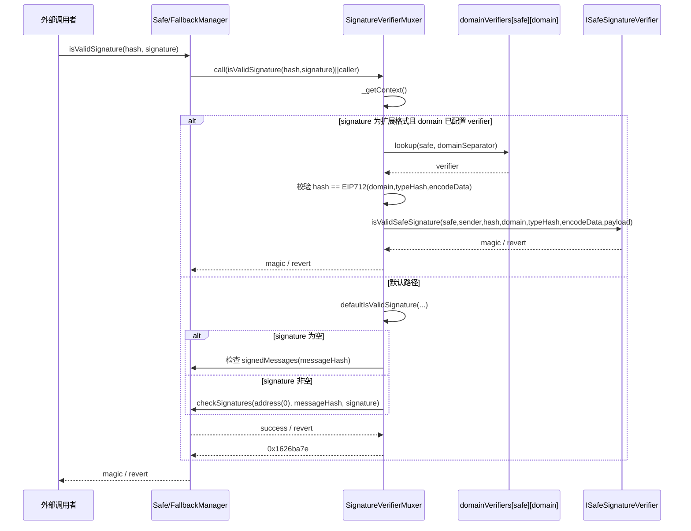
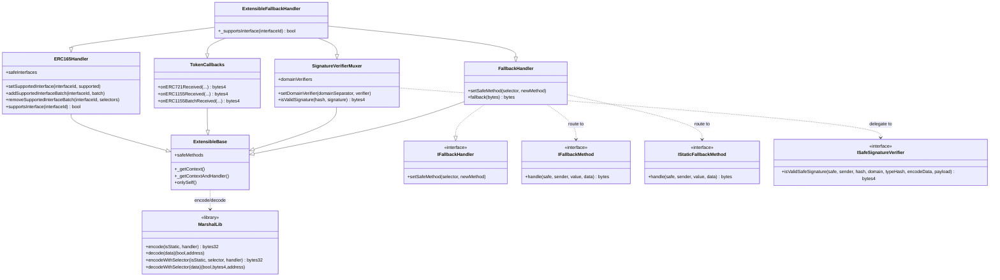

# Safe FallbackHandler 拓展性设计分析

本文聚焦 Safe **>= 1.3.0** 的 fallback handler 机制，围绕 `CompatibilityFallbackHandler` 与 `ExtensibleFallbackHandler` 的分工、运行时路径、状态结构与扩展方式展开。分析覆盖以下文件及其关系：

- `contracts/handler/CompatibilityFallbackHandler.sol`
- `contracts/handler/ExtensibleFallbackHandler.sol`
- `contracts/handler/extensible/FallbackHandler.sol`
- `contracts/handler/extensible/ExtensibleBase.sol`
- `contracts/handler/extensible/ERC165Handler.sol`
- `contracts/handler/extensible/MarshalLib.sol`
- `contracts/handler/extensible/SignatureVerifierMuxer.sol`
- `contracts/handler/extensible/TokenCallbacks.sol`
- `test/handlers/ExtensibleFallbackHandler.spec.ts`
- `docs/Safe-FallbackHandler-扩展机制分析.md`

## 1. 总体设计思路
结论：Safe 需要 fallback handler，是为了在不把大量非核心能力塞进钱包主合约的前提下，补齐标准接口兼容性并开放扩展面。

### Safe 为什么需要 fallback handler
定义/作用：Safe 核心合约专注于 owner 管理、多签校验、模块与 guard 等核心能力，但外部生态会期待钱包地址表现出更多接口，例如 `ERC-1271`、`ERC-721/1155 receiver`、模拟执行、以及 dApp 自定义扩展方法。  
实现：Safe 在 `contracts/base/FallbackManager.sol` 中实现 `fallback()`，当调用未命中 Safe 自身 selector 时，把请求转发给事先配置的**主 fallback handler**。  
约束：主 fallback handler 不是钱包本体，只是 Safe 的“扩展解释层”；它必须依赖 Safe fallback 上下文才能正确工作。

### CompatibilityFallbackHandler 和 ExtensibleFallbackHandler 的定位差异
定义/作用：`CompatibilityFallbackHandler` 是固定能力集合，强调“兼容旧生态”；`ExtensibleFallbackHandler` 是组合式扩展平台，强调“按 Safe 实例可配置”。  
实现：前者把 `EIP-1271`、token callbacks、`simulate(...)`、EIP-712 编码辅助等直接写死在单个主 fallback handler 中；后者通过 `FallbackHandler + SignatureVerifierMuxer + TokenCallbacks + ERC165Handler` 组合，并引入 `safeMethods`、`safeInterfaces`、`domainVerifiers` 三类状态。  
约束：`CompatibilityFallbackHandler` 开箱即用但扩展有限；`ExtensibleFallbackHandler` 更灵活，但前提是 Safe 必须满足 **>= 1.3.0** 的“在 fallback 转发时把原始调用者地址追加到 calldata 末尾”的语义。

### ExtensibleFallbackHandler 的核心扩展思想是什么
定义/作用：它的核心不是“多写几个函数”，而是把 Safe fallback 变成一个“按 Safe 隔离配置的路由层”。  
实现：未知 selector 通过 `safeMethods[safe][selector]` 路由到 `processor（外部处理器）`，接口支持通过 `safeInterfaces[safe][interfaceId]` 声明，签名扩展通过 `domainVerifiers[safe][domainSeparator]` 委托。  
约束：这三张表都以 `Safe` 为一维 key，因此同一个主 fallback handler 单例可以服务多个 Safe，但每个 Safe 的扩展配置彼此隔离。

## 2. Safe Fallback 调用总览
结论：Safe fallback 体系的关键不是“主 fallback handler 被调用”本身，而是 Safe 如何把原始调用语义转译为主 fallback handler 可理解的上下文。

### 2.1 调用链路
定义/作用：外部调用先进入 `SafeProxy`，再 delegatecall 到 `Safe` 单例；只有当 Safe 没有匹配到 selector 时，才进入 `FallbackManager.fallback()`。  
实现：`FallbackManager.fallback()` 从 `FALLBACK_HANDLER_STORAGE_SLOT` 读取主 fallback handler，把原始 calldata 原样复制后，在末尾追加 20 字节 `caller()`，随后 `call(handler, ...)`。因此主 fallback handler 中 `msg.sender = Safe`，而原始调用者地址会在主 fallback handler 侧被恢复为 `sender`。  
约束：如果没有配置主 fallback handler，则 Safe 的 fallback 直接空返回；如果主 fallback handler 脱离该上下文被直接调用，则 `_msgSender()` / `_manager()` 语义不成立。

关键源码如下：

```59:76:contracts/base/FallbackManager.sol
assembly {
    let handler := sload(FALLBACK_HANDLER_STORAGE_SLOT)
    if iszero(handler) {
        return(0, 0)
    }
    let ptr := mload(0x40)
    calldatacopy(ptr, 0, calldatasize())
    // 在 calldata 副本末尾追加 caller() 的 20 字节（左移 96 位去零填充），供 handler 识别原始调用方
    mstore(add(ptr, calldatasize()), shl(96, caller()))
    // 有效 payload 长度 = 原 calldata 长度 + 20
    let success := call(gas(), handler, 0, ptr, add(calldatasize(), 20), 0, 0)

    returndatacopy(ptr, 0, returndatasize())
    if iszero(success) {
        revert(ptr, returndatasize())
    }
    return(ptr, returndatasize())
}
```

这段代码直接说明了三件事：

- Safe fallback 转发时会把 `caller()` 写到 calldata 尾部。
- 主 fallback handler 收到的 `msg.sender` 一定是 Safe，而不是外部 EOA/合约。
- 主 fallback handler 若 revert，Safe 的 fallback 会把 returndata 原样转发给外部调用方（`revert(ptr, returndatasize())`）；若成功，则把主 fallback handler 的返回值原样转发（`return(ptr, returndatasize())`）。

树状调用链：

```text
外部调用
└── SafeProxy.fallback()
    └── delegatecall 到 Safe 单例
        └── Safe / FallbackManager.fallback()
            └── call(主 fallback handler, originalCalldata || caller)
                ├── 命中主 fallback handler 已声明函数
                │   ├── SignatureVerifierMuxer.isValidSignature(...)
                │   ├── TokenCallbacks.onERC721Received(...)
                │   ├── TokenCallbacks.onERC1155Received(...)
                │   ├── TokenCallbacks.onERC1155BatchReceived(...)
                │   ├── ERC165Handler.supportsInterface(...)
                │   └── setSafeMethod / setDomainVerifier / setSupportedInterface ...
                └── 未命中主 fallback handler 已声明函数
                    └── FallbackHandler.fallback()
                        └── safeMethods[safe][selector] -> processor（外部处理器）.handle(...)
```

Mermaid 调用链图：



图中关键节点说明：

- `FallbackManager.fallback` 是 Safe 侧唯一的未知 selector 入口。
- `call 主 fallback handler + caller` 是 Safe 与主 fallback handler 的协议约定，解决了主 fallback handler 中 `msg.sender` 被改写的问题。
- `命中主 fallback handler 已声明函数` 与 `未命中进入通用 fallback 路由` 是两条完全不同的路径。
- `safeMethods[safe][selector]` 只影响“通用 fallback 路由”，不影响主 fallback handler 自己显式实现的函数。

### 2.2 显式函数路径 vs 通用路由路径
定义/作用：这张图专门回答一个最容易混淆的问题: `safeMethods[safe][selector]` 不是“所有未知 Safe selector 的第一站”，它只有在 **Safe 自身未命中** 且 **主 fallback handler 显式函数也未命中** 之后才会被查询。  
实现：判断顺序严格是 `Safe 自身 selector -> 主 fallback handler 显式函数 -> safeMethods 路由表`。  
约束：因此像 `isValidSignature(...)`、`supportsInterface(...)`、`onERC721Received(...)`、`setSafeMethod(...)` 这些函数，即使也发生在 fallback 体系里，本质上仍属于“主 fallback handler 显式函数路径”，而不是通用路由路径。



图中关键节点说明：

- 第一层判断是“Safe 自身有没有这个 selector”，这一步和 handler 无关。
- 第二层判断是“主 fallback handler 自己有没有显式实现这个函数”，这一步决定走内置能力还是进入通用路由。
- 只有走到 `FallbackHandler.fallback()` 之后，`safeMethods[safe][selector]` 才真正参与决策。
- 所以 `safeMethods` 的职责不是补齐 `ERC-1271`、NFT 回调或 `supportsInterface`，而是承接“主 fallback handler 也不认识的 selector”。

### 2.3 全局组件图 / 分层图
定义/作用：前两张图还在描述“调用如何进入”与“进入后怎么分流”；这张图进一步把 `Proxy / Safe / 主 fallback handler / processor / verifier` 放进不同层里，帮助你快速看清楚调用是在哪一层切换语义的。  
实现：图中把入口层、账户实例层、Safe 运行时层、主 fallback handler 层、外部扩展层拆开，并显式标出 `msg.sender = Safe` 与 `sender = 末尾 20 字节恢复值` 这两个最关键的上下文转换。  
约束：这张图强调的是**运行时分层**，不是继承树；因此同一对象在源码里可能是继承关系，但在图里会被放到不同的运行时职责层中。



图中关键节点说明：

- `账户实例层` 只有 `SafeProxy`，它负责承接地址上的外部调用，但实际逻辑执行仍在 singleton 上。
- `Safe 运行时层` 是 selector 是否命中 Safe 原生函数、以及是否进入 `FallbackManager.fallback()` 的分界层。
- `主 fallback handler 层` 是语义切换最关键的一层：从这里开始，`msg.sender` 已经不再是外部用户，而是 Safe；原始调用者要通过 `_msgSender()` 重新恢复。
- `内置显式函数路径` 与 `通用路由路径` 是主 fallback handler 内部的两条主干：前者处理 `isValidSignature`、token callbacks、`supportsInterface`、配置函数，后者才会查 `safeMethods[safe][selector]`。
- `外部扩展层` 只有两类真正插件点：通用 selector 路由对应的 `processor（外部处理器）`，以及 `ERC-1271` 扩展路径对应的 verifier。

### 2.4 全局 UML 类图
定义/作用：前面的图已经把调用顺序、分流判定和运行时边界讲清；这张图改从“源码结构关系”出发，把 `SafeProxy -> Safe/FallbackManager -> ExtensibleFallbackHandler -> processor/verifier` 这条主链一次性串起来。  
实现：它同时覆盖 Safe 侧入口、主 fallback handler 侧组合关系，以及最终可替换的外部扩展点。  
约束：这是一张“全局关系图”，强调谁依赖谁、谁调用谁；而第四章的类图更偏 Extensible 内部模块拆分，两者关注点不同。



图中关键节点说明：

- `SafeProxy -> Safe` 表示账户实例层与逻辑单例层的分离，外部调用先落到 proxy，再 delegatecall 到 Safe 单例。
- `Safe --|> FallbackManager` 强调 fallback 入口是 Safe 继承体系的一部分，而不是额外挂接的独立合约。
- `FallbackManager --> ExtensibleFallbackHandler` 表示 Safe 在未命中自身 selector 时，把请求转发给主 fallback handler。
- `ExtensibleFallbackHandler` 往下拆成 `FallbackHandler / SignatureVerifierMuxer / TokenCallbacks / ERC165Handler`，分别对应通用路由、签名扩展、token 回调和 ERC165 支持。
- 真正可插拔的外部扩展点只有两类：一类是 `IFallbackMethod / IStaticFallbackMethod` 形式的 `processor（外部处理器）`，另一类是 `ISafeSignatureVerifier` 形式的 verifier。

### 2.5 时序图：外部调用进入通用 fallback 路由
定义/作用：该路径处理的是“Safe 不认识、主 fallback handler 也不认识，但已通过 `setSafeMethod` 注册”的 selector。  
实现：Safe 先把调用转给主 fallback handler；主 fallback handler 若没有这个 selector 的显式函数实现，则进入 `FallbackHandler.fallback()`，读取 `safeMethods[safe][msg.sig]` 后再调用 `processor（外部处理器）`。  
约束：如果 selector 未注册，或 `processor（外部处理器）` 地址为 0，则会直接 revert `"method handler not set"`。



图中关键节点说明：

- `selector_X` 必须先未命中 Safe 自身函数。
- Handler 在收到调用后，只有"未命中自身已声明函数"时才会触发 `FallbackHandler.fallback()`。
- `sender` 不是 handler 的 `msg.sender`，而是 `_msgSender()` 从 calldata 末尾恢复出的“原始调用者”。
- `dataWithoutSender` 是 `selector_X || args`，末尾 20 字节原始调用者地址会被剥离后再转给处理器。
- 若处理器 revert，Safe 的 `FallbackManager.fallback()` 会通过 `revert(ptr, returndatasize())` 把 returndata 原样转发给外部调用者，不会吞掉错误信息。

### 2.6 时序图：ERC-1271 签名校验路径
定义/作用：`safe.isValidSignature(...)` 在 Extensible 下不是单一路径，而是“默认路径 + domain verifier 扩展路径”的二选一。  
实现：`SignatureVerifierMuxer.isValidSignature(...)` 先尝试按扩展签名格式解析 verifier 路径，若不满足条件则回退到 `defaultIsValidSignature(...)`。  
约束：扩展路径不是无条件开放，必须同时满足“签名格式正确、domain 已授权 verifier、重算 hash 一致”。



图中关键节点说明：

- 扩展格式的 selector 固定为 `0x5fd7e97d`，即 `safeSignature(bytes32,bytes32,bytes,bytes)`。
- `domainVerifiers` 是“某个 Safe 对某个 domain 的授权表”，不是全局 verifier 表。
- 默认路径会把 `_hash` 再包装进 Safe 自己的 `SafeMessage(bytes message)` 域，这一点与直觉不同，但与 Safe 既有行为保持一致。

## 3. CompatibilityFallbackHandler 与 ExtensibleFallbackHandler 对比
结论：二者依赖同一套 Safe fallback 机制，但设计目标不同，导致能力边界与扩展方式完全不同。

定义/作用：`CompatibilityFallbackHandler` 追求“固定兼容层”，`ExtensibleFallbackHandler` 追求“可扩展框架层”。  
实现：前者直接实现 `getMessageHash`、`encodeTransactionData`、`simulate`、`isValidSignature`、token callbacks 等固定函数；后者把能力拆成多个 mixin，并把未知 selector 交给可配置路由。  
约束：前者功能固定，几乎无需配置；后者更灵活，但配置必须通过 Safe 自己发起。

对比摘要：

| 维度 | CompatibilityFallbackHandler | ExtensibleFallbackHandler |
|---|---|---|
| 定位 | 固定兼容层 | 可配置扩展层 |
| 能力组织方式 | 单体写死 | 组合式 mixin |
| Token 回调 | ERC721 / ERC1155 / ERC777 | ERC721 / ERC1155 |
| ERC-1271 | 默认 Safe 逻辑 | 默认逻辑 + domain 扩展 |
| selector 扩展 | 不支持 | `safeMethods[safe][selector]` |
| ERC165 动态声明 | 基本固定 | `safeInterfaces` + batch 注册 |
| 典型用途 | 兼容旧 SDK / 低配置 | 会话密钥 / 多域签名 / 自定义方法 |

补充：Compatibility 对 `ERC-777` 的支持来自 `TokenCallbackHandler.tokensReceived(...)`，这条路径与 Extensible 的 `TokenCallbacks + onlyFallback` 语义并不相同；它更接近兼容层直接内置的 receiver 能力。

## 4. ExtensibleFallbackHandler 的模块组成
结论：Extensible 的核心价值来自“按设计问题拆模块”，而不是按文件顺序堆功能。

### 4.1 模块职责拆分
定义/作用：整套设计可以分成“上下文恢复层、通用路由层、标准能力层、组合层”四层。  
实现：

- `HandlerContext`：定义 `onlyFallback`、`_msgSender()`、`_manager()`，负责从 Safe fallback 调用中恢复上下文。
- `ExtensibleBase`：持有 `safeMethods`，定义 `onlySelf`、`_getContext()`、`_getContextAndHandler()`，是扩展基座。
- `FallbackHandler`：处理未知 selector 的通用路由，核心是 `setSafeMethod(...)` 与 `fallback(...)`。
- `ERC165Handler`：处理 `supportsInterface(...)`、`setSupportedInterface(...)`、`addSupportedInterfaceBatch(...)`、`removeSupportedInterfaceBatch(...)`。
- `SignatureVerifierMuxer`：处理 `ERC-1271` 默认逻辑与 `domainVerifiers` 路由。
- `TokenCallbacks`：处理 `onERC721Received`、`onERC1155Received`、`onERC1155BatchReceived`。
- `MarshalLib`：把路由元数据打包为 `bytes32`。
- `ExtensibleFallbackHandler`：最终组合壳，只声明默认支持哪些接口。

约束：标准能力层中的 token callbacks 与 `isValidSignature` 都是 handler 的显式函数，因此不会进入通用 selector 路由。

### 4.2 类图（Mermaid classDiagram）
定义/作用：该图展示 Extensible 如何通过继承与接口分工形成完整运行时。  
实现：`ExtensibleFallbackHandler` 本身几乎没有业务逻辑，主要负责继承组合。  
约束：真正可被外部替换的扩展点是 `IFallbackMethod` / `IStaticFallbackMethod` / `ISafeSignatureVerifier`，而不是 `ExtensibleFallbackHandler` 自身。



图中关键节点说明：

- `ExtensibleBase` 是统一基座，所有 extensible 模块都共享它的上下文与状态语义。
- `FallbackHandler` 管 selector 路由，`SignatureVerifierMuxer` 管签名扩展，`ERC165Handler` 管接口声明，`TokenCallbacks` 管 NFT 接收。
- `MarshalLib` 只做编解码，不直接参与权限或调用控制。

## 5. 核心数据结构与编码格式
结论：Extensible 的“可扩展”不是动态加载代码，而是通过三张映射表加一个紧凑编码协议实现。

### 5.1 safeMethods
定义/作用：`safeMethods[safe][selector]` 表示“某个 Safe 对某个 selector 的路由配置”。  
实现：值类型是 `bytes32 packed method`，通过 `MarshalLib.decode(...)` 解出 `(isStatic, handler)`；这里源码变量名叫 `handler`，但语义上更准确地说，它表示该 selector 对应的 `processor（外部处理器）` 地址。`FallbackHandler.fallback()` 读取这张表决定把请求发给哪个 `processor（外部处理器）`。  
约束：`processor（外部处理器）` 地址为 0 视为未配置；只有通用 fallback 路由才会查这张表。

对应基座代码：

```46:53:contracts/handler/extensible/ExtensibleBase.sol
/**
 * Safe 级别的方法路由表：safeMethods[safe][selector] = packed(method)。
 * packed method（bytes32）编码规则（详见 MarshalLib）：
 * - 最高 1 字节：0x00 = static(view)，0x01 = 非 static。
 * - 低 20 字节：处理器合约地址。
 */
mapping(ISafe => mapping(bytes4 => bytes32)) public safeMethods;
```

路由语义可以直接写成：

```text
safeMethods[safe][selector]
= 这个 Safe 收到该 selector 时
  若 Safe 自身未实现
  且 handler 自身也未显式实现
  就把请求转给哪个 processor（外部处理器）
```

### 5.2 safeInterfaces
定义/作用：`safeInterfaces[safe][interfaceId]` 表示“某个 Safe 声明支持某个 interfaceId”。  
实现：`ERC165Handler.supportsInterface(...)` 的判定顺序是固定接口 -> `_supportsInterface(...)` -> `safeInterfaces[safe][interfaceId]`。  
约束：它只影响 `supportsInterface(...)` 的返回值，不会自动生成某个 selector 的处理逻辑。

### 5.3 domainVerifiers
定义/作用：`domainVerifiers[safe][domainSeparator]` 表示“某个 Safe 在某个 EIP-712 domain 下授权的签名 verifier”。  
实现：`SignatureVerifierMuxer.isValidSignature(...)` 识别到扩展格式签名后，会先查这张表，再决定是否委托 `ISafeSignatureVerifier`。  
约束：这张表是按 Safe 隔离的，因此同一个 verifier 不会自动对所有 Safe 生效。

### 5.4 MarshalLib 编码布局
定义/作用：`MarshalLib` 用单个 `bytes32` 同时携带 `isStatic / selector / handler`，方便存储和批量注册。  
实现：

- `encode(isStatic, handler)` 用于 `safeMethods`。
- `encodeWithSelector(isStatic, selector, handler)` 用于 `addSupportedInterfaceBatch(...)` 的批量注册。

编码布局：

```text
1. encode(isStatic, handler)

bytes32
┌────────────┬───────────────────────────────┐
│ 1 byte     │ 11 bytes zero │ 20 bytes     │
│ flag       │ padding       │ handler      │
└────────────┴───────────────────────────────┘

flag = 0x00  -> static/view
flag = 0x01  -> non-static

2. encodeWithSelector(isStatic, selector, handler)

bytes32
┌────────┬────────────┬──────────────┬───────────────┐
│ 1 byte │ 4 bytes    │ 7 bytes zero │ 20 bytes      │
│ flag   │ selector   │ padding      │ handler       │
└────────┴────────────┴──────────────┴───────────────┘
```

约束：`selector` 只在 batch 编码里存在，因为它主要用于 `ERC165` 批量注册时做 XOR 校验，最后真正写入 `safeMethods` 的仍然是 `encode(isStatic, handler)`。

## 6. 运行时核心流程
结论：Extensible 的运行时不是一条单一路径，而是按 selector 类型与能力类型分成三套逻辑。

### 6.1 通用 selector 路由流程
定义/作用：该流程处理的是“未命中主 fallback handler 已声明函数”的 selector。  
实现：

1. 外部 `call(Safe, selector_X || args)`。
2. Safe 未命中自身函数，进入 `FallbackManager.fallback()`。
3. Safe 转发到主 fallback handler，并在 calldata 末尾追加 20 字节原始调用者地址。
4. 主 fallback handler 侧若未命中显式函数，触发 `FallbackHandler.fallback()`。
5. `_getContextAndHandler()` 恢复 `(safe, sender, isStatic, handler)`；其中这里的 `handler` 语义上是 `processor（外部处理器）` 地址。
6. 读取 `safeMethods[safe][selector_X]`。
7. 剥离末尾 20 字节原始调用者地址后，把 `selector_X || args` 转给 `processor（外部处理器）`。

约束：只有“未命中主 fallback handler 已声明函数”时，才会进入这条路径。

对应路由代码：

```58:68:contracts/handler/extensible/FallbackHandler.sol
fallback(bytes calldata) external returns (bytes memory result) {
    require(msg.data.length >= 24, "invalid method selector");
    (ISafe safe, address sender, bool isStatic, address handler) = _getContextAndHandler();
    require(handler != address(0), "method handler not set");

    bytes calldata dataWithoutSender = msg.data[:msg.data.length - 20];
    if (isStatic) {
        result = IStaticFallbackMethod(handler).handle(safe, sender, 0, dataWithoutSender);
    } else {
        result = IFallbackMethod(handler).handle(safe, sender, 0, dataWithoutSender);
    }
}
```

上下文恢复代码：

```58:61:contracts/handler/extensible/ExtensibleBase.sol
modifier onlySelf() {
    require(_msgSender() == _manager(), "only safe can call this method");
    _;
}
```

```91:108:contracts/handler/extensible/ExtensibleBase.sol
function _getContext() internal view returns (ISafe safe, address sender) {
    safe = ISafe(payable(_manager()));
    sender = _msgSender();
}

function _getContextAndHandler() internal view returns (ISafe safe, address sender, bool isStatic, address handler) {
    (safe, sender) = _getContext();
    (isStatic, handler) = MarshalLib.decode(safeMethods[safe][msg.sig]);
}
```

这里必须区分两条路径：

- **命中主 fallback handler 已声明函数**：如 `isValidSignature(...)`、`onERC721Received(...)`、`supportsInterface(...)`，直接执行，不查 `safeMethods`。
- **未命中后进入通用 fallback 路由**：如 `lookAtMe()`、`0xdeadbeef` 这类未知 selector，才查 `safeMethods[safe][selector]`。

测试里 `lookAtMe()` 的例子正好证明了这条路由真实会把 `safe` 与原始 `sender` 一起传进处理器：

```324:358:test/handlers/ExtensibleFallbackHandler.spec.ts
const tx = {
    to: safeAddress,
    data: mirror.interface.encodeFunctionData("lookAtMe"),
};

await expect(user1.call(tx)).to.be.reverted;

await executeContractCallWithSigners(
    safe,
    validator,
    "setSafeMethod",
    ["0x7f8dc53c", encodeHandler(true, await mirror.getAddress())],
    [user1, user2],
);

expect(await user1.call(tx)).to.be.eq(
    "0x" +
        "25d6803f" +
        "000000000000000000000000" +
        safeAddress.slice(2).toLowerCase()
```

这个断言里的返回值前缀 `25d6803f` 是 `handle(address,address,uint256,bytes)` 的 selector，后面紧跟 `safeAddress` 与 `user1.address`，说明最终命中的是 `processor（外部处理器）`，而不是主 fallback handler 自己的显式函数。

### 6.2 Token 回调流程
定义/作用：这条路径让 Safe 具备 `ERC-721 / ERC-1155` 安全接收能力。  
实现：NFT 合约调用 Safe 地址上的 `onERC721Received(...)` / `onERC1155Received(...)` 时，Safe 自身没有这些函数，于是 fallback 到主 fallback handler；但主 fallback handler 自己显式实现了这些函数，因此直接命中 `TokenCallbacks`，返回标准 magic value。  
约束：`TokenCallbacks` 用 `onlyFallback` 做 fallback 上下文校验，因此把 token 直接转给主 fallback handler 单例地址会失败；但这里更准确的理解应是“上下文保护/约束”，而不是把 `onlyFallback` 当成唯一安全边界。

对应实现代码：

```21:28:contracts/handler/extensible/TokenCallbacks.sol
abstract contract TokenCallbacks is ExtensibleBase, ERC1155TokenReceiver, ERC721TokenReceiver {
    function onERC1155Received(address, address, uint256, uint256, bytes calldata) external view override onlyFallback returns (bytes4) {
        return 0xf23a6e61;
    }
```

```36:52:contracts/handler/extensible/TokenCallbacks.sol
function onERC1155BatchReceived(
    address,
    address,
    uint256[] calldata,
    uint256[] calldata,
    bytes calldata
) external view override onlyFallback returns (bytes4) {
    return 0xbc197c81;
}

function onERC721Received(address, address, uint256, bytes calldata) external view override onlyFallback returns (bytes4) {
    return 0x150b7a02;
}
```

为什么 `TokenCallbacks` 属于内置能力，不走通用 selector 路由：

- 这些 selector 是标准且固定的。
- Safe 设置主 fallback handler 后就应该立即具备接收 NFT 的能力，不应要求用户再手工 `setSafeMethod(...)`。
- 这些回调需要 `onlyFallback` 语义，而不是可随意配置的插件化路由。

测试例子：

- `test/handlers/ExtensibleFallbackHandler.spec.ts` 中，ERC721 与 ERC1155 都验证了“转给 Safe 成功、转给主 fallback handler 单例失败”。
- 例如 `safeTransferFrom(user, safe, tokenId)` 成功；`safeTransferFrom(user, 主 fallback handler 单例地址, tokenId)` 报 `"not a fallback call"`。

ERC721 测试片段：

```222:241:test/handlers/ExtensibleFallbackHandler.spec.ts
it("should allow a Safe to receive ERC-721 tokens", async () => {
    const { safe, user1, erc721 } = await setupTests();
    await erc721.mint(await user1.getAddress(), 1);

    await expect(
        erc721
            .connect(user1)
            ["safeTransferFrom(address,address,uint256)"](await user1.getAddress(), await safe.getAddress(), 1),
    ).to.not.be.reverted;
});

it("should revert when tokens are transferred directly to the handler", async () => {
```

### 6.3 ERC-1271 默认路径与扩展路径
定义/作用：这条路径让 Safe 既保持原生 `ERC-1271` 兼容性，又能为特定 domain 增加定制化验签。  
实现：

- **默认路径**：调用 `defaultIsValidSignature(...)`。它会把传入的 `_hash` 再包装成 Safe 的 `SafeMessage(bytes message)`，然后空签名查 `signedMessages(messageHash)`，非空签名调用 `safe.checkSignatures(address(0), messageHash, signature)`。
- **扩展路径**：如果 `signature` 前 4 字节是 `0x5fd7e97d`，且 `domainVerifiers[safe][domainSeparator]` 已配置 verifier，则先校验 `_hash == EIP712(domainSeparator, typeHash, encodeData)`，再委托 verifier。

约束：

- 伪造 `domainSeparator` 没用，因为 Muxer 会重算 hash 做一致性校验。
- verifier 未配置时，扩展格式签名不会被接受，会退回默认路径并最终失败。

对应实现代码：

```153:183:contracts/handler/extensible/SignatureVerifierMuxer.sol
function isValidSignature(bytes32 _hash, bytes calldata signature) external view override returns (bytes4 magic) {
    (ISafe safe, address sender) = _getContext();

    if (signature.length >= 4) {
        bytes4 sigSelector;
        assembly {
            sigSelector := calldataload(signature.offset)
        }

        if (sigSelector == SAFE_SIGNATURE_MAGIC_VALUE && signature.length >= 68) {
            (bytes32 domainSeparator, bytes32 typeHash) = abi.decode(signature[4:68], (bytes32, bytes32));
            ISafeSignatureVerifier verifier = domainVerifiers[safe][domainSeparator];
            if (address(verifier) != address(0)) {
                (, , bytes memory encodeData, bytes memory payload) = abi.decode(signature[4:], (bytes32, bytes32, bytes, bytes));
                if (keccak256(EIP712.encodeMessageData(domainSeparator, typeHash, encodeData)) == _hash) {
                    return verifier.isValidSafeSignature(safe, sender, _hash, domainSeparator, typeHash, encodeData, payload);
                }
            }
        }
    }
```

```198:212:contracts/handler/extensible/SignatureVerifierMuxer.sol
function defaultIsValidSignature(ISafe safe, bytes32 _hash, bytes memory signature) internal view returns (bytes4 magic) {
    bytes memory messageData = EIP712.encodeMessageData(
        safe.domainSeparator(),
        SAFE_MSG_TYPEHASH,
        abi.encode(keccak256(abi.encode(_hash)))
    );
    bytes32 messageHash = keccak256(messageData);

    if (signature.length == 0) {
        require(safe.signedMessages(messageHash) != 0, "Hash not approved");
    } else {
        safe.checkSignatures(address(0), messageHash, signature);
    }
```

测试例子：

- **默认路径**：先通过 `SignMessageLib.signMessage(dataHash)` 批准消息，再调用 `safe.isValidSignature(dataHash, "0x")`，返回 `0x1626ba7e`。
- **setDomainVerifier 扩展路径**：在测试中先为某个 `domainSeparator` 绑定 `TestSafeSignatureVerifier`，之后 `preconfiguredValidator.isValidSignature(dataHash, encodedMessage)` 成功，而未配置 verifier 的 `validator` 同样调用会失败。

默认路径测试片段：

```552:556:test/handlers/ExtensibleFallbackHandler.spec.ts
it("should return magic value if message was signed", async () => {
    const { user1, user2, safe, validator, signLib } = await setupTests();
    const dataHash = ethers.keccak256("0xbaddad");
    await executeContractCallWithSigners(safe, signLib, "signMessage", [dataHash], [user1, user2], true);
    expect(await validator.isValidSignature.staticCall(dataHash, "0x")).to.be.eq("0x1626ba7e");
});
```

扩展 verifier 测试片段：

```690:706:test/handlers/ExtensibleFallbackHandler.spec.ts
it("should return magic value if signed by a domain verifier", async () => {
    const { validator, preconfiguredValidator } = await setupTests();
    const domainSeparator = ethers.keccak256("0xdeadbeef");
    const typeHash = ethers.keccak256("0xbaddad");
    const encodeData = hre.ethers.AbiCoder.defaultAbiCoder().encode(
        ["bytes32"],
        [ethers.keccak256("0xbaddadbaddadbaddadbaddadbaddadbaddad")],
    );

    const [dataHash, encodedMessage] = encodeCustomVerifier(encodeData, domainSeparator, typeHash, "0x");
```

## 7. 配置与使用方式
结论：Extensible 的所有可写配置都必须满足 `onlySelf`；在正常使用语义下，这意味着应通过“Safe 调自己”来完成配置。

### 7.1 setSafeMethod
定义/作用：为某个 selector 绑定一个 `processor（外部处理器）`，是通用 selector 路由的入口。  
实现：`setSafeMethod(selector, newMethod)` 最终写入 `safeMethods[safe][selector]`。`newMethod` 通常来自 `MarshalLib.encode(isStatic, handler)`；这里编码进去的 `handler` 在业务语义上就是该 selector 对应的 `processor（外部处理器）` 地址。  
约束：标准且有意义的调用方式是由 Safe 自调用执行，不能把主 fallback handler 单例当成普通配置合约来直接使用。

配置入口本身非常短，但 `onlySelf` 语义非常关键：

```46:48:contracts/handler/extensible/FallbackHandler.sol
function setSafeMethod(bytes4 selector, bytes32 newMethod) public override onlySelf {
    _setSafeMethod(ISafe(payable(_msgSender())), selector, newMethod);
}
```

测试例子：

- 先对 `lookAtMe()` 的 selector `0x7f8dc53c` 调用，调用 Safe 会 revert，因为还没有配置 `processor（外部处理器）`。
- 再通过 `executeContractCallWithSigners(safe, validator, "setSafeMethod", [...])` 配置后，重复调用会命中 `mirror.handle(...)`。
- 另一个测试把 `0xdeadbeef` 配成 non-static `processor（外部处理器）`，调用后 `counter.count` 从 0 变成 1，证明 non-static 路由可写状态。

### 7.2 setSupportedInterface / addSupportedInterfaceBatch
定义/作用：前者负责单独声明接口支持，后者负责"批量装配 selector 路由 + 声明支持"。  
实现：`addSupportedInterfaceBatch(interfaceId, handlerWithSelectors)` 会逐个 `decodeWithSelector(...)`，为每个 selector 调 `_setSafeMethod(...)`，同时 XOR 所有 selector 并要求结果等于 `interfaceId`。最终调用 `setSupportedInterface(_interfaceId, true)` 写入接口支持记录。  
约束：接口 ID 不匹配会直接 revert `"interface id mismatch"`，防止批量配置写错接口。

> **注意**：`setSupportedInterface`（第 52-64 行）内部用 `_manager()` 获取 safe，`addSupportedInterfaceBatch` / `removeSupportedInterfaceBatch` 则用 `_msgSender()`（第 91、111 行）。在 `onlySelf` 成立的场景下两者等价（Safe 自调用时 `_manager() == _msgSender()`），但语义层面前者强调"当前调用者就是 Safe"，后者从 calldata 末尾显式恢复原始调用者。

批量注册实现代码：

```90:102:contracts/handler/extensible/ERC165Handler.sol
function addSupportedInterfaceBatch(bytes4 _interfaceId, bytes32[] calldata handlerWithSelectors) external override onlySelf {
    ISafe safe = ISafe(payable(_msgSender()));
    bytes4 interfaceId = bytes4(0);
    uint256 len = handlerWithSelectors.length;
    for (uint256 i = 0; i < len; ++i) {
        (bool isStatic, bytes4 selector, address handlerAddress) = MarshalLib.decodeWithSelector(handlerWithSelectors[i]);
        _setSafeMethod(safe, selector, MarshalLib.encode(isStatic, handlerAddress));
        interfaceId ^= selector;
    }

    require(interfaceId == _interfaceId, "interface id mismatch");
    setSupportedInterface(_interfaceId, true);
}
```

测试例子：

- 批量注册 `0xabababab / 0xcdcdcdcd / 0xefefefef` 到同一个 `mirror` 后，测试验证三个 `ChangedSafeMethod` 事件与一个 `AddedInterface` 事件都会发出。
- 注册完成后，`validator.supportsInterface(interfaceId)` 返回 `true`。
- 批量移除后，三个 selector 的路由清空，`RemovedInterface` 事件发出，`supportsInterface(interfaceId)` 返回 `false`。

### 7.3 setDomainVerifier
定义/作用：为某个 EIP-712 `domainSeparator` 指定一个 `ISafeSignatureVerifier`。  
实现：`setDomainVerifier(domainSeparator, verifier)` 更新 `domainVerifiers[safe][domainSeparator]`，并发出 `ChangedDomainVerifier`。  
约束：同样应经过 Safe 自调用，这样 `_msgSender() == _manager()` 才具有正确且稳定的业务语义。

对应实现代码：

```140:144:contracts/handler/extensible/SignatureVerifierMuxer.sol
function setDomainVerifier(bytes32 domainSeparator, ISafeSignatureVerifier newVerifier) public override onlySelf {
    ISafe safe = ISafe(payable(_msgSender()));
    ISafeSignatureVerifier oldVerifier = domainVerifiers[safe][domainSeparator];
    domainVerifiers[safe][domainSeparator] = newVerifier;
    emit ChangedDomainVerifier(safe, domainSeparator, oldVerifier, newVerifier);
}
```

测试例子：

- 直接调用主 fallback handler 上的 `setDomainVerifier(...)` 会报 `"only safe can call this method"`。
- 通过 `executeContractCallWithSigners(safe, validator, "setDomainVerifier", [...])` 可以正常写入，并在后续 `isValidSignature(...)` 中命中扩展 verifier 路径。

## 8. 关键设计点
结论：Extensible 的关键不在某个函数，而在几组“被故意设计成这样”的语义约定。

定义/作用：以下几点是理解整个体系的抓手。  
实现：

1. **FallbackManager 为什么在 calldata 末尾追加 20 字节原始调用者地址**  
   因为主 fallback handler 中 `msg.sender` 已经变成 Safe 本身，必须额外携带“原始调用者”，主 fallback handler 才能在自己的语义里恢复出 `sender`。

2. **`_manager()`、`_msgSender()`、`_getContext()`、`_getContextAndHandler()` 的语义**  
   - `_manager()`：当前 handler 的调用者，即 Safe。
   - `_msgSender()`：从 calldata 末尾恢复的原始调用者。
   - `_getContext()`：恢复 `(safe, sender)`。
   - `_getContextAndHandler()`：在上下文基础上，再解析出当前 selector 的 `(isStatic, handler)`。

3. **onlySelf 为什么要求“Safe 调自己”**  
   因为它检查的是 `_msgSender() == _manager()`。只有当 Safe 发起一笔 `to = Safe` 的交易，Safe fallback 再把这笔调用转给 handler 时，追加到 calldata 末尾的原始调用者地址才会正好是 Safe 自己。

4. **FallbackHandler.fallback() 的真正触发条件**  
   不是“Safe 没命中函数”就够了，而是“Safe 没命中函数，且 handler 也没命中任何显式实现函数”。

5. **`safeMethods[safe][selector]` 的路由含义**  
   它表示“这个 Safe 在未知 selector 路径下，针对该 selector 的最终处理器是谁”，不是全局 handler 配置。

6. **`safeInterfaces`、`domainVerifiers` 的作用**  
   - `safeInterfaces`：接口声明层，影响 `supportsInterface(...)`。
   - `domainVerifiers`：按 EIP-712 domain 的验签扩展层。

7. **为什么不能把 fallback handler 设成 `address(this)`**  
   `FallbackManager` 明确禁止这样做（`GS400`）。原因是 Safe fallback 会在 calldata 末尾拼接 caller，如果 handler 就是 Safe 自己，攻击者可以利用“短 calldata + 地址首字节”去拼出新的 4-byte selector，造成对 Safe 内部受保护方法的伪造命中风险。

约束：这些语义都建立在 Safe fallback 协议之上，脱离该上下文去理解，很容易误判行为。

其中 `_msgSender()` 与 `_manager()` 的底层来源非常直接：

```31:44:contracts/handler/HandlerContext.sol
function _msgSender() internal pure returns (address sender) {
    require(msg.data.length >= 20, "Invalid calldata length");
    assembly {
        sender := shr(96, calldataload(sub(calldatasize(), 20)))
    }
}

function _manager() internal view returns (address) {
    return msg.sender;
}
```

## 9. 易错点与边界条件
结论：这套设计很强，但“上下文正确”是第一前提，许多误用都源于把主 fallback handler 当成普通业务合约来直接调用。

定义/作用：这一节列出最常见的误解与边界。  
实现：

- **常见误区 1**：只要外部调用未命中 Safe，就会进入 `FallbackHandler.fallback()`。  
  实际上还要再经过一层“主 fallback handler 是否命中已声明函数”的判断。

- **常见误区 2**：主 fallback handler 里的 `msg.sender` 就是外部调用者。  
  实际上主 fallback handler 里的 `msg.sender` 是 Safe，原始调用者在 calldata 末尾 20 字节。

- **常见误区 3**：可以直接调用主 fallback handler 单例地址完成配置。  
  实际上这些配置函数的正确用法是由 Safe 自调用完成；否则 `_msgSender()` 只是“从普通 calldata 末尾硬解析出来的 20 字节”，语义会失真。

- **常见误区 4**：只要设置了 `setDomainVerifier`，任意 hash 都能走 verifier。  
  实际上 `_hash` 必须和 `(domainSeparator, typeHash, encodeData)` 重算结果完全一致。

- **常见误区 5**：Token callbacks 也可以像普通 selector 一样用 `setSafeMethod` 配。  
  实际上它们是主 fallback handler 的内置显式函数，不走通用 selector 路由。

边界条件：

- Safe 必须 **>= 1.3.0**。
- 直接调用主 fallback handler 上的 `isValidSignature(...)` 会 revert，因为缺少 Safe fallback 上下文。
- 通用 fallback 要求 `msg.data.length >= 24`，否则报 `"invalid method selector"`。
- 未配置 selector 时，通用路由会报 `"method handler not set"`。
- token 直接转给主 fallback handler 单例地址会失败，不应把主 fallback handler 当成接收地址。
- Safe 不能把自己的 fallback handler 设为 `address(this)`；源码会以 `GS400` 拒绝这种配置，原因是短 calldata 伪造 selector 风险。

## 10. 总结
结论：`ExtensibleFallbackHandler` 的本质，是把 Safe 从“带固定兼容插件的钱包”升级成“带可配置扩展总线的钱包”。

定义/作用：它保留了 Safe 在 token 接收、`ERC-1271`、`ERC-165` 等标准场景的开箱即用体验，同时把更复杂的定制需求抽象为通用路由与域级验签扩展。  
实现：这套能力依赖三张核心状态表：

- `safeMethods`：按 selector 路由未知方法。
- `safeInterfaces`：按 interfaceId 声明接口支持。
- `domainVerifiers`：按 EIP-712 domain 扩展签名校验。

约束：它不是简单的功能叠加，而是建立在 Safe fallback 协议、“原始调用者地址被追加到 calldata 末尾”的语义，以及 `onlySelf` 权限模型之上的体系化设计。因此，理解 Extensible 的关键不是记住每个文件，而是记住三件事：

1. Safe 负责转发，并在 calldata 末尾补回原始调用者地址。
2. 主 fallback handler 先处理内置标准函数，再把未知 selector 路由到 `processor（外部处理器）`。
3. 一切扩展配置都以 Safe 实例为中心，而不是以主 fallback handler 单例为中心。

## 11. 源码定位索引
结论：如果你已经理解整体思路，后续最高效的阅读方式不是按文件顺序扫，而是按“问题”回到对应函数。

### 11.1 关键问题 -> 源码位置
定义/作用：这一节把最常问的问题映射到最关键的函数，方便做二次查阅。  
实现：优先列入口函数与状态定义，再列具体扩展点。  
约束：下表中的位置是理解入口，不代表该问题的全部上下文。

| 你想搞清楚的问题 | 优先看这里 | 说明 |
|---|---|---|
| 外部调用如何进入 Safe fallback | `contracts/base/FallbackManager.sol` 的 `fallback()` | Safe 如何把调用转发给 handler，并追加 20 字节原始调用者地址 |
| 为什么要追加 20 字节原始调用者地址 | `contracts/base/FallbackManager.sol` 的 `fallback()` | 主 fallback handler 中 `msg.sender` 已经是 Safe，需要额外恢复原始调用者 |
| handler 如何恢复原始调用者 | `contracts/handler/HandlerContext.sol` 的 `_msgSender()` | 从 calldata 末尾读取 20 字节地址 |
| `_manager()` / `_msgSender()` 语义是什么 | `contracts/handler/HandlerContext.sol` | `_manager() = msg.sender = Safe`，`_msgSender() = 原始调用者` |
| onlySelf 为什么要求 Safe 调自己 | `contracts/handler/extensible/ExtensibleBase.sol` 的 `onlySelf` | 只有 `_msgSender() == _manager()` 时才允许配置 |
| 通用 selector 路由在哪里发生 | `contracts/handler/extensible/FallbackHandler.sol` 的 `fallback()` | `safeMethods[safe][msg.sig]` 路由的唯一入口 |
| `safeMethods[safe][selector]` 究竟存了什么 | `contracts/handler/extensible/ExtensibleBase.sol` 的 `safeMethods` 与 `MarshalLib` | 存的是压缩后的 `(isStatic, handler)` |
| `MarshalLib` 如何打包 `isStatic / selector / handler` | `contracts/handler/extensible/MarshalLib.sol` | `encode / decode / encodeWithSelector / decodeWithSelector` |
| ERC165 动态声明与批量注册在哪里做 | `contracts/handler/extensible/ERC165Handler.sol` | `setSupportedInterface`、`addSupportedInterfaceBatch`、`supportsInterface` |
| 为什么 `TokenCallbacks` 不走通用 selector 路由 | `contracts/handler/extensible/TokenCallbacks.sol` | 它们本身就是 handler 已声明函数 |
| `safe.isValidSignature(...)` 的默认路径在哪里 | `contracts/handler/extensible/SignatureVerifierMuxer.sol` 的 `defaultIsValidSignature()` | 复现 Safe 默认 `ERC-1271` 逻辑 |
| `safe.isValidSignature(...)` 的扩展路径在哪里 | `contracts/handler/extensible/SignatureVerifierMuxer.sol` 的 `isValidSignature()` | 先识别扩展签名，再按 domain 查 verifier |
| 为什么伪造 domainSeparator 不生效 | `contracts/handler/extensible/SignatureVerifierMuxer.sol` 的 hash 一致性校验 | `_hash` 必须等于重算的 EIP-712 digest |
| Compatibility 与 Extensible 最大差异在哪里 | `contracts/handler/CompatibilityFallbackHandler.sol` 与 `contracts/handler/ExtensibleFallbackHandler.sol` | 前者固定兼容层，后者组合式扩展层 |
| Compatibility 的固定 EIP-1271 逻辑在哪里 | `contracts/handler/CompatibilityFallbackHandler.sol` 的 `isValidSignature()` | 和 Extensible 默认路径非常接近，但没有 domain mux |
| Compatibility 的 simulate 能力在哪里 | `contracts/handler/CompatibilityFallbackHandler.sol` 的 `simulate()` | 用 `simulateAndRevert(...)` 在 Safe 上下文里做只读模拟 |
| Compatibility 的交易编码辅助在哪里 | `contracts/handler/CompatibilityFallbackHandler.sol` 的 `encodeTransactionData()` | 构造 Safe 交易的 EIP-712 pre-image |

### 11.2 测试用例 -> 设计点映射
定义/作用：如果你想从行为验证反推设计，这一小节是最直接的入口。  
实现：把高价值测试和其验证目标一一对应。  
约束：测试文件很长，建议只先看下列 case，再按需要展开。

| 测试行为 | 对应设计点 |
|---|---|
| `should allow a Safe to receive ERC-721 tokens` | Token 回调是 handler 内置能力，Safe 可直接接收 NFT |
| `should revert when tokens are transferred directly to the handler` | `onlyFallback` 会校验 fallback 上下文，因此主 fallback handler 单例地址不能充当接收地址 |
| `setSafeMethod -> lookAtMe()` | 通用 selector 路由如何把 `safe` 与原始 `sender` 透传给 `processor（外部处理器）` |
| `should allow calling non-static methods` | `isStatic = false` 时路由可执行写状态逻辑 |
| `should return magic value if message was signed` | `ERC-1271` 默认空签名路径依赖 `signedMessages` |
| `should send EIP-712 context to custom verifier` | `SignatureVerifierMuxer` 会把完整 `(safe, sender, hash, domain, typeHash, encodeData, payload)` 传给 verifier |
| `should revert it trying to forge the domain separator` | 扩展 verifier 路径前的 hash 一致性校验 |
| `should return magic value if signed by a domain verifier` | `setDomainVerifier` 生效后，特定 domain 的扩展验签可接管默认路径 |
| `should add all handlers in batch` | `addSupportedInterfaceBatch` 同时完成 selector 路由写入与接口声明 |
| `should remove all methods in a batch` | 批量移除时既清路由，也撤销接口支持 |

## 12. 推荐阅读顺序
结论：第一次读这套设计，最顺手的顺序是“先入口，再上下文，再路由，再标准能力，最后看 Compatibility 对照”。

### 12.1 第一次阅读建议
定义/作用：这一顺序适合第一次完整理解 Safe fallback 扩展体系。  
实现：从协议入口往功能层推进，避免一上来陷进 `SignatureVerifierMuxer` 的细节。  
约束：不要按文件名字母顺序读，那样最容易把“内置函数路径”和“通用 fallback 路由”混在一起。

建议顺序：

1. `contracts/base/FallbackManager.sol`  
   先搞清楚 Safe 是怎么把“未知 selector”交给 handler 的，以及 20 字节 caller 是怎么附加的。

2. `contracts/handler/HandlerContext.sol`  
   再搞清楚主 fallback handler 侧如何恢复上下文，理解 `_manager()` 与 `_msgSender()` 的区别。

3. `contracts/handler/extensible/ExtensibleBase.sol`  
   理解 `onlySelf`、`safeMethods`、`_getContext()`、`_getContextAndHandler()`，这是所有 extensible 模块的地基。

4. `contracts/handler/extensible/FallbackHandler.sol`  
   明白通用 selector 路由的真实触发条件，以及“未命中主 fallback handler 已声明函数”这件事。

5. `contracts/handler/extensible/TokenCallbacks.sol`  
   先看一组最简单、最直观的内置能力，帮助区分“显式函数实现”和“通用 fallback 路由”。

6. `contracts/handler/extensible/SignatureVerifierMuxer.sol`  
   在已经理解上下文与路由后，再看 `ERC-1271` 默认路径与 domain verifier 扩展路径。

7. `contracts/handler/extensible/ERC165Handler.sol`  
   最后看接口声明与批量注册，理解 `safeInterfaces` 与 `safeMethods` 为什么要拆开。

8. `contracts/handler/extensible/MarshalLib.sol`  
   此时再看打包格式会最顺，因为你已经知道这些 `bytes32` 最终被谁消费。

9. `contracts/handler/ExtensibleFallbackHandler.sol`  
   这时再回头看组合壳，会很清楚它只是把几块能力拼起来。

10. `contracts/handler/CompatibilityFallbackHandler.sol`  
    作为对照阅读，理解“固定兼容层”和“可扩展框架层”的差异。

### 12.2 如果你只关心某一类问题
定义/作用：不同读者的关注点不同，这里给出按问题裁剪的最短阅读路径。  
实现：每条路径都尽量控制在 2 到 4 个文件。  
约束：如果看完仍有疑问，再回到 `ExtensibleBase` 补足上下文层。

- **只想看 Safe 是怎么把 caller 传给 handler 的**  
  读 `FallbackManager.sol` -> `HandlerContext.sol`

- **只想看 selector 路由怎么做插件化**  
  读 `ExtensibleBase.sol` -> `FallbackHandler.sol` -> `MarshalLib.sol`

- **只想看 ERC-1271 扩展签名**  
  读 `SignatureVerifierMuxer.sol` -> `ExtensibleBase.sol` -> 对照 `CompatibilityFallbackHandler.sol`

- **只想看 NFT 回调为什么不用 setSafeMethod 配**  
  读 `TokenCallbacks.sol` -> `FallbackHandler.sol`

- **只想看接口批量注册和 ERC165**  
  读 `ERC165Handler.sol` -> `MarshalLib.sol` -> `ExtensibleFallbackHandler.sol`

- **只想看行为验证**  
  读 `test/handlers/ExtensibleFallbackHandler.spec.ts` 中的 `Token Callbacks`、`Custom methods`、`Signature Verifier Muxer`、`IERC165` 四个 describe 块

## 13. 术语表
结论：Safe fallback 体系里最容易混淆的不是代码本身，而是“谁是谁”。这份术语表统一本文中若干高频词的含义。

### caller
定义/作用：`caller` 是站在 Safe 侧、按 EVM 语义观察到的“当前正在调用 Safe 的地址”；在 `FallbackManager.fallback()` 里，它会被追加到 calldata 尾部。  
实现：源码里这个词主要出现在 `caller()` 这个 assembly opcode 上。进入主 fallback handler 之后，本文不再把它当主要名词，而是把“从末尾 20 字节恢复出来的 caller”统一称为 `sender`。  
约束：因此，本文里凡是提到 `caller`，通常都特指 **Safe 追加到 calldata 末尾的原始调用者地址**；进入主 fallback handler 语义后，优先使用 `sender`。

### manager
定义/作用：`manager` 指当前主 fallback handler 调用的直接发起者，在 Safe fallback 场景中就是 **Safe 本身**。  
实现：在 `HandlerContext` 里，`_manager()` 直接返回 `msg.sender`；由于主 fallback handler 是被 Safe 的 `FallbackManager.fallback()` 调用的，因此这里的 `msg.sender` 不是外部用户，而是 Safe。  
约束：`manager` 只在“主 fallback handler 正在被 Safe fallback 调用”这个语境里才有稳定含义。若直接调用主 fallback handler 单例地址，`manager` 就会退化成那个直接调用者。

### sender
定义/作用：`sender` 指“原始调用 Safe 的地址”，也就是 Safe fallback 转发之前的外部调用者。  
实现：Safe 在 `FallbackManager.fallback()` 中把 `caller()` 追加到 calldata 末尾；主 fallback handler 再通过 `_msgSender()` 从最后 20 字节恢复它。因此本文中的 `sender` 一律不是主 fallback handler 的 `msg.sender`，而是“被补回来的原始调用者”。  
约束：只有在 Safe >= 1.3.0 且调用确实经过 Safe fallback 转发时，`sender` 语义才正确成立。

### safe
定义/作用：`safe` 指“当前这次主 fallback handler 调用所属的 Safe 实例”。  
实现：在 `ExtensibleBase._getContext()` / `_getContextAndHandler()` 里，`safe = ISafe(payable(_manager()))`，也就是把当前主 fallback handler 的直接调用者解释为所属 Safe。  
约束：本文里的 `safe` 是一个“上下文内的 Safe 实例/地址角色”，不是泛指 Safe 协议，也不是全局唯一的主 fallback handler 所属账户。

### handler
定义/作用：为减少歧义，本文把 `handler` 拆成两层：**主 fallback handler** 与 `processor（外部处理器）`。前者承接 Safe 未命中的 selector，后者是通用路由最终调用的业务处理合约。  
实现：在 Safe 侧，`FALLBACK_HANDLER_STORAGE_SLOT` 保存的是主 fallback handler 地址；在 Extensible 体系里，`ExtensibleFallbackHandler` 就是主 fallback handler，而 `safeMethods[safe][selector]` 里编码的地址则是 `processor（外部处理器）`。  
约束：本文若未特别说明，单独写 `handler` 时优先指主 fallback handler；谈 `safeMethods`、`handle(...)`、路由目标时，则优先写 `processor（外部处理器）`。

### processor（外部处理器）
定义/作用：`processor` 指通用 selector 路由最终命中的外部业务处理合约，实现 `IFallbackMethod` 或 `IStaticFallbackMethod`。  
实现：它不是 Safe 直接配置的主 fallback handler，而是主 fallback handler 从 `safeMethods[safe][selector]` 中解码出来并继续调用的下一跳。  
约束：`processor` 只存在于“未命中主 fallback handler 显式函数，转而进入通用路由”的路径里；像 `isValidSignature(...)`、`supportsInterface(...)`、token callbacks 这些主 fallback handler 自带函数不会经过 processor。

### verifier
定义/作用：`verifier` 指负责执行扩展签名校验逻辑的外部合约，实现接口 `ISafeSignatureVerifier`。  
实现：`SignatureVerifierMuxer` 并不自己定义所有 domain 的验签规则，而是通过 `domainVerifiers[safe][domainSeparator]` 找到对应 verifier，再把 `(safe, sender, hash, domainSeparator, typeHash, encodeData, payload)` 委托给它判断。  
约束：verifier 只在 `ERC-1271` 的扩展路径里生效；默认路径并不会查 verifier。未授权的 domain 即使签名格式正确，也不会触发 verifier。

### interfaceId
定义/作用：`interfaceId` 是 ERC-165 语义下的 4 字节接口标识，通常由该接口中所有函数 selector 做 XOR 得到。  
实现：在 `ERC165Handler` 中，`supportsInterface(interfaceId)` 会先检查固定支持的接口，再检查 `_supportsInterface(...)`，最后检查 `safeInterfaces[safe][interfaceId]`。`addSupportedInterfaceBatch(...)` 还会通过 XOR 所有 selector 来校验传入的 `interfaceId` 是否正确。  
约束：`interfaceId` 是“接口声明层”的概念，不等于函数实现本身。某个 Safe 可以声明支持某接口，但具体 selector 是否可调用，仍取决于 handler 显式实现或 `safeMethods` 路由是否存在。

### domainSeparator
定义/作用：`domainSeparator` 是 EIP-712 域分隔符，用来把签名语义绑定到某个具体 domain。  
实现：在 `SignatureVerifierMuxer` 里，`domainSeparator` 既是扩展签名格式的一部分，也是 `domainVerifiers[safe][domainSeparator]` 的 key。Muxer 会用它和 `typeHash + encodeData` 重新计算 EIP-712 digest，并要求结果与传入 `_hash` 一致。  
约束：`domainSeparator` 不是随便传一个 bytes32 就行；它必须和调用方声称签名的 `_hash` 对得上，否则会因为 hash 不一致而退回默认路径或直接失败。

### SafeMessage
定义/作用：`SafeMessage` 是 Safe 在默认 `ERC-1271` / `signMessage` 体系里使用的 EIP-712 结构体语义，对应类型 `SafeMessage(bytes message)`。  
实现：无论在 `CompatibilityFallbackHandler` 还是 `SignatureVerifierMuxer.defaultIsValidSignature(...)` 中，传入的 `_hash` 都不会被直接拿去查签名，而是会先包装成 Safe 自己的 `SafeMessage` 域，再结合 `safe.domainSeparator()` 计算最终 `messageHash`。  
约束：这是 Safe 默认签名语义里最容易误解的点。外部看到的是 `isValidSignature(hash, sig)`，但内部实际校验的是“把这个 hash 当作 SafeMessage 内容再包装后的 hash”，因此它与某些协议直接对原始 `_hash` 做校验的逻辑并不相同。

### 术语关系速记
定义/作用：如果你只想快速记住这些词之间的关系，可以用下面这张对照。  
实现：它把 Safe fallback 场景里最常见的几个角色放在一行中。  
约束：这张表默认语境都是“调用已经经过 Safe fallback 转发到主 fallback handler”。

| 术语 | 在 Safe fallback 语境中的含义 |
|---|---|
| `caller` | Safe 在 fallback 转发时用 `caller()` 取到并追加到 calldata 末尾的原始调用者地址 |
| `manager` | 当前调用 handler 的 Safe |
| `sender` | handler 从 calldata 尾部恢复出的原始调用者；语义上对应上面的 `caller` |
| `safe` | 当前这次 handler 调用所属的 Safe 实例 |
| `handler` | 默认指 Safe 配置的主 fallback handler |
| `processor` | 通用 selector 路由最终命中的 `processor（外部处理器）` |
| `verifier` | 扩展 `ERC-1271` 路径中的域级签名校验器 |
| `interfaceId` | ERC-165 的接口标识，不等于具体函数实现 |
| `domainSeparator` | EIP-712 域分隔符，是 verifier 路由 key 与 hash 校验输入 |
| `SafeMessage` | Safe 默认签名体系中的消息包装结构 |

## 14. 常见调用身份对照表
结论：理解 Extensible Fallback Handler，最关键的是分清“当前谁在调用 handler”与“最初是谁在调用 Safe”。下面按常见场景统一列出 `msg.sender / manager / sender / safe` 的映射。

### 14.1 阅读方法
定义/作用：这张表中的五列分别表示：

- `msg.sender`：当前 Solidity 函数体里看到的 `msg.sender`
- `_manager()`：`HandlerContext._manager()` 的返回值
- `_msgSender()`：`HandlerContext._msgSender()` 从 calldata 末尾恢复出的原始调用者地址
- `safe`：若代码里调用 `_getContext()` / `_getContextAndHandler()`，拿到的 `safe`
- `sender`：若代码里调用 `_getContext()` / `_getContextAndHandler()`，拿到的 `sender`

实现：只有“调用已经经过 Safe fallback 转发到主 fallback handler”时，这五列才会形成稳定关系；否则 `_msgSender()`、`safe`、`sender` 可能失真甚至直接 revert。  
约束：下面的表默认讨论的是主 fallback handler 侧视角，不是 Safe 侧视角。

### 14.2 场景总表
定义/作用：这一表按最常见的实际调用场景汇总身份关系。  
实现：优先覆盖文档里最容易混淆的几类路径。  
约束：其中“直接调用主 fallback handler 单例”一行是反例，用来说明为什么很多函数脱离 Safe 上下文会失败。

| 场景 | `msg.sender` | `_manager()` | `_msgSender()` | `safe` | `sender` | 备注 |
|---|---|---|---|---|---|---|
| 1. 外部用户调用 `Safe`，未命中 Safe 函数，进入主 fallback handler 的通用路由 | Safe | Safe | 外部用户/外部合约 | Safe | 外部用户/外部合约 | 最标准的 fallback 扩展场景 |
| 2. 外部用户调用 `safe.isValidSignature(...)`，进入 `SignatureVerifierMuxer` | Safe | Safe | 外部用户/外部合约 | Safe | 外部用户/外部合约 | 命中主 fallback handler 已声明函数，不走通用路由 |
| 3. NFT 合约回调 `safe.onERC721Received(...)` / `onERC1155Received(...)` | Safe | Safe | NFT 合约 | Safe | NFT 合约 | `TokenCallbacks` 中 `sender` 是代币合约，不是用户 |
| 4. Safe 自己调用自己以执行 `setSafeMethod(...)` / `setDomainVerifier(...)` | Safe | Safe | Safe | Safe | Safe | 这是 `onlySelf` 成立的关键场景 |
| 5. 直接调用主 fallback handler 单例地址上的 `setSafeMethod(...)` / `isValidSignature(...)` | 外部调用者 | 外部调用者 | 不可靠，通常报错或语义错误 | 不成立 | 不成立 | 不经过 Safe fallback，不应这样使用 |
| 6. 通用路由后的 `processor（外部处理器）` `handle(safe, sender, ...)` 内部看到的参数 | 处理器的直接调用者是主 fallback handler | 不适用 | 不适用 | 由参数传入的 Safe | 由参数传入的原始调用者 | 处理器不需要自己再解析 calldata 末尾 20 字节 |
| 7. `SignatureVerifierMuxer` 调用外部 verifier `isValidSafeSignature(...)` | verifier 的直接调用者是 Muxer | 不适用 | 不适用 | 由参数传入的 Safe | 由参数传入的原始调用者 | verifier 通过参数拿上下文，而不是自己读 `_msgSender()` |

### 14.3 逐场景说明
结论：只要记住“`msg.sender` 在主 fallback handler 里通常是 Safe，而原始调用者在 `_msgSender()` 里”，大部分身份问题都会变清楚。

#### 场景 1：外部用户调用 Safe 的未知 selector
定义/作用：这是通用 selector 路由的典型路径，例如 `lookAtMe()` 或 `0xdeadbeef`。  
实现：外部用户先调用 Safe；Safe fallback 转发到主 fallback handler 后，主 fallback handler 内部 `msg.sender = Safe`，`_msgSender() = 外部用户`，因此 `_getContext()` 返回 `(safe = Safe, sender = 外部用户)`。  
约束：只有当该 selector 未命中主 fallback handler 已声明函数时，才会继续进入 `FallbackHandler.fallback()` 查 `safeMethods[safe][selector]`。

#### 场景 2：外部用户调用 `safe.isValidSignature(...)`
定义/作用：这是 `SignatureVerifierMuxer` 的入口场景。  
实现：对主 fallback handler 而言，身份关系与场景 1 相同，仍是 `msg.sender = Safe`、`_manager() = Safe`、`_msgSender() = 外部调用者`；只是因为 `isValidSignature(...)` 是主 fallback handler 显式实现的函数，所以不会进入通用 selector 路由。  
约束：因此 `SignatureVerifierMuxer` 里看到的 `sender` 是调用 `safe.isValidSignature(...)` 的外部地址，而不是签名人地址。

#### 场景 3：NFT 合约回调 Safe
定义/作用：这是 `TokenCallbacks` 的标准使用场景。  
实现：当 ERC-721 / ERC-1155 合约在转账后回调 Safe 地址时，Safe fallback 再转发给主 fallback handler。此时主 fallback handler 中：

- `msg.sender = Safe`
- `_manager() = Safe`
- `_msgSender() = NFT 合约地址`
- `_getContext()` 返回 `(safe = Safe, sender = NFT 合约地址)`

约束：这里最容易误解的是 `sender`。在 token 回调场景里，它不是发起转账的用户，而是“实际调用 Safe 的 NFT 合约”。

#### 场景 4：Safe 自调用配置函数
定义/作用：这是 `setSafeMethod(...)`、`setDomainVerifier(...)`、`setSupportedInterface(...)` 的标准配置姿势。  
实现：当 Safe 发起一笔 `to = Safe` 的交易并携带这些配置函数的 calldata 时，Safe fallback 追加到 handler calldata 末尾的原始调用者地址正好也是 Safe 自己。因此：

- `msg.sender = Safe`
- `_manager() = Safe`
- `_msgSender() = Safe`
- `_getContext()` 返回 `(safe = Safe, sender = Safe)`

约束：这就是 `onlySelf` 检查 `_msgSender() == _manager()` 的根本原因。它表达的是“当前上下文里，恢复出的原始调用者与当前 manager 相同”，而标准业务语义下这正对应 Safe 自己批准并发起配置动作。

#### 场景 5：直接调用主 fallback handler 单例
定义/作用：这是错误用法，但非常常见。  
实现：如果你直接对主 fallback handler 实现地址发起调用，那么主 fallback handler 中：

- `msg.sender = 外部调用者`
- `_manager() = 外部调用者`
- `_msgSender()` 会试图从普通 calldata 的末尾 20 字节解析地址

约束：由于这时 calldata 末尾并不是 Safe fallback 追加的原始调用者地址，`_msgSender()` 语义会错，很多函数会直接 revert，或在逻辑上得到错误上下文。所以像 `handler.isValidSignature(...)`、`handler.setSafeMethod(...)` 这类调用都不应直接对单例地址进行。

### 14.4 一句话记忆法
定义/作用：如果不想每次都展开整套表，可以记下面四句话。  
实现：它们对应 Extensible 里最稳定的身份规律。  
约束：仍然默认前提是“调用已经经过 Safe fallback”。

1. 在 handler 里，`msg.sender` 基本都是 **Safe**。  
2. 在 handler 里，真正的原始调用者基本都在 `_msgSender()`。  
3. `safe` 是“这次 handler 调用所属的 Safe”，通常等于 `_manager()`。  
4. `sender` 是“谁最先调用了 Safe”，通常等于 `_msgSender()`。
