# Safe Smart Account 源码解析与机制分析

## 目录

- [1. 概述与阅读指引](#1-概述与阅读指引)
  - [1.1 项目简介](#11-项目简介)
  - [1.2 项目结构](#12-项目结构)
  - [1.3 建议阅读路径](#13-建议阅读路径)
- [2. 架构设计与核心概念](#2-架构设计与核心概念)
  - [2.1 总体架构](#21-总体架构)
  - [2.2 核心概念](#22-核心概念)
  - [2.3 Safe 与 SafeL2](#23-safe-与-safel2)
- [3. 核心生命周期](#3-核心生命周期)
  - [3.1 账户创建](#31-账户创建)
  - [3.2 主交易执行](#32-主交易执行)
- [4. 关键机制](#4-关键机制)
  - [4.1 交易哈希与 EIP-712](#41-交易哈希与-eip-712)
  - [4.2 签名验证系统](#42-签名验证系统)
  - [4.3 Gas 与费用机制](#43-gas-与费用机制)
  - [4.4 Fallback 体系](#44-fallback-体系)
- [5. 扩展系统：Module 与 Guard](#5-扩展系统module-与-guard)
  - [5.1 模块执行](#51-模块执行)
  - [5.2 Guard 机制](#52-guard-机制)
  - [5.3 权限风险矩阵](#53-权限风险矩阵)
- [6. 存储布局](#6-存储布局)
  - [6.1 关键 slot 分布](#61-关键-slot-分布)
  - [6.2 链表管理](#62-链表管理)
- [7. 开发者参考](#7-开发者参考)
  - [7.1 常见错误码索引](#71-常见错误码索引)
  - [7.2 核心函数索引](#72-核心函数索引)
  - [7.3 相关工具库](#73-相关工具库)
- [源码引用](#源码引用)

---

## 1. 概述与阅读指引

### 1.1 项目简介

**Safe Smart Account**（原 Gnosis Safe）是一套非托管的智能合约协议，用于创建可编程的多签账户。交易需经多个所有者（owners）授权才能执行，相比普通 EOA 提供更高安全性与资金保护。当前仓库版本为 **v1.5.0**，合约采用 Solidity 0.7.6，构建系统为 Hardhat。

本报告围绕三个问题展开：Safe 的账户模型是怎样组织的，多签与模块调用是如何落到链上执行的，以及 fallback、Guard、签名验证等扩展机制如何与主流程配合。

### 1.2 项目结构

#### 目录与模块

| 目录/文件 | 职责 |
|-----------|------|
| `contracts/Safe.sol` | 主实现：多签核心逻辑（L1 版，基础事件更少，不发完整交易参数事件） |
| `contracts/SafeL2.sol` | L2 版 Safe，继承 Safe 并增加交易/模块执行事件 |
| `contracts/base/` | 基础能力：OwnerManager、ModuleManager、GuardManager、FallbackManager、Executor |
| `contracts/common/` | 通用组件：Singleton、SelfAuthorized、签名解码、EIP 扩展等 |
| `contracts/proxies/` | SafeProxy（委托调用实现）、SafeProxyFactory（CREATE2 工厂） |
| `contracts/handler/` | Fallback 处理器（Compatibility / Extensible）及 HandlerContext |
| `contracts/libraries/` | MultiSend、CreateCall、SignMessageLib、SafeMigration、SafeStorage 等 |
| `contracts/interfaces/` | ISafe、IModuleManager、IGuardManager、Enum 等接口定义 |
| `contracts/accessors/` | SimulateTxAccessor（模拟执行） |
| `src/` | TypeScript 部署脚本与工具（deploy_*、utils） |
| `test/` | Hardhat 测试；`certora/` 为形式化验证配置与规格 |
| `docs/TeachingSafe-教学版说明.md` | 教学说明文档，用于辅助理解 Safe 核心机制 |

#### 技术栈

- **语言**: Solidity ≥0.7.0 <0.9.0（主合约固定 0.7.6 以保证字节码稳定与部署确定性）
- **构建**: Hardhat 2.x，solc 0.7.6
- **脚本**: TypeScript（部署、任务、工具函数）
- **验证**: Certora 规格与配置

### 1.3 建议阅读路径

如果是第一次阅读这个仓库，建议按“先主线、后扩展、再辅助组件”的顺序看：

1. `contracts/proxies/SafeProxy.sol`、`contracts/proxies/SafeProxyFactory.sol`
   先理解 proxy 模式、`CREATE2` 地址生成，以及为什么 `initializer` 会参与地址计算。
2. `contracts/Safe.sol`
   抓住两条主线：`setup()` 初始化与 `execTransaction()` 多签执行。
3. `contracts/base/OwnerManager.sol`、`contracts/base/ModuleManager.sol`、`contracts/base/GuardManager.sol`、`contracts/base/FallbackManager.sol`
   这四个 base 合约分别对应 owner、module、guard、fallback 四个核心扩展面。
4. `contracts/handler/CompatibilityFallbackHandler.sol` 与 `contracts/handler/ExtensibleFallbackHandler.sol`
   对比旧兼容处理器与新 extensible 处理器的职责差异。
5. `contracts/handler/extensible/`
   这一层再深入读 `ExtensibleBase`、`FallbackHandler`、`SignatureVerifierMuxer`、`ERC165Handler`、`MarshalLib`，理解可扩展 fallback 处理器的内部路由机制。
6. `contracts/libraries/` 与 `contracts/accessors/`
   最后再看 `MultiSend`、`MultiSendCallOnly`、`SafeToL2Setup`、`SignMessageLib`、`SimulateTxAccessor` 等辅助组件，理解生态使用方式。

---

## 2. 架构设计与核心概念

### 2.1 总体架构

下图从分层与合约职责角度概括 Safe Smart Account 的整体结构。自上而下分别是入口层、代理层、核心实现层、基础能力层与扩展层；实线表示调用或委托关系，虚线表示按需挂载的扩展关系。

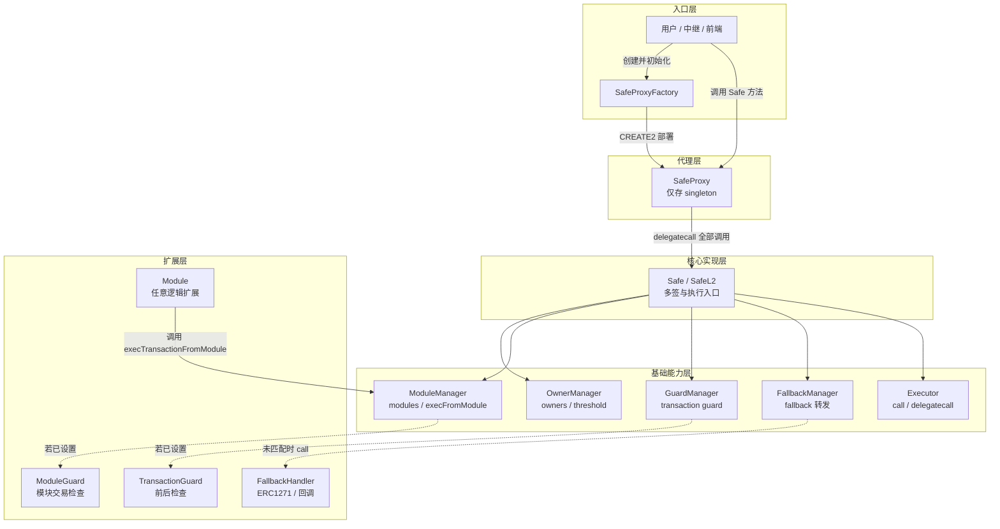

**图 1：分层架构**：入口层负责创建和发起调用；代理层负责转发；核心实现层负责多签与执行；基础能力层提供 owner、module、Guard、fallback 处理与执行能力；扩展层提供可选的处理器、Guard 与模块。注意 Module 箭头方向：是模块主动调用 `ModuleManager`，而不是 `ModuleManager` 调用模块。

### 2.2 核心概念

#### Proxy-Singleton 模式

Safe 采用的是一种**自定义的 singleton delegatecall proxy**：`SafeProxy` 持有状态与余额，`Safe` / `SafeL2` 作为实现合约提供逻辑，二者通过 `delegatecall` 结合。它和常见升级框架里的 Transparent Proxy 并不完全相同，但目标一致，都是把状态与逻辑分开。

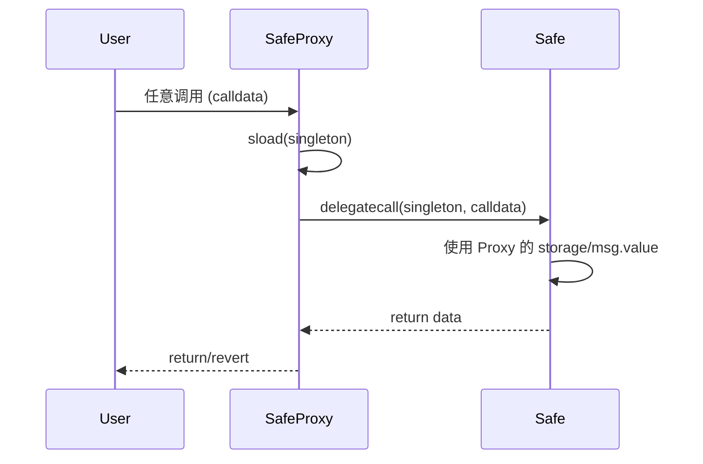

- **SafeProxy**：仅保存 `singleton`（实现地址），所有调用都通过 `delegatecall` 转发到实现合约。
- **实现合约**：`Safe` / `SafeL2` 中第一个状态变量同样是 `singleton`，与 Proxy 的 storage slot 0 对齐，目的是保证 `delegatecall` 时的存储布局一致。
- **初始化保护**：实现合约自身不会被当作钱包使用。原因是 `Safe` 构造函数先把 `threshold` 设为 `1`，因此如果有人直接对实现合约调用 `setup()`，`setupOwners()` 会因“已初始化”而回滚。

#### 核心继承与组合（UML 类图）

Safe 通过多重继承组合 owner、module、guard、fallback 等能力。下图展示核心类之间的关系：

```mermaid
classDiagram
    class SafeProxyFactory {
        +createProxyWithNonce(_singleton, initializer, saltNonce)
        +createProxyWithNonceL2(_singleton, initializer, saltNonce)
        +createChainSpecificProxyWithNonce(_singleton, initializer, saltNonce)
        +createChainSpecificProxyWithNonceL2(_singleton, initializer, saltNonce)
    }

    class SafeProxy {
        -singleton : address
        +fallback()
    }

    class Safe {
        +setup(_owners, _threshold, to, data, fallbackHandler, paymentToken, payment, paymentReceiver)
        +execTransaction(to, value, data, operation, safeTxGas, baseGas, gasPrice, gasToken, refundReceiver, signatures)
        +checkSignatures(executor, dataHash, signatures)
        +checkNSignatures(executor, dataHash, signatures, requiredSignatures)
        +approveHash(hashToApprove)
        +getTransactionHash(...)
        +domainSeparator()
    }

    class SafeL2 {
        +onBeforeExecTransaction(...)
        +onBeforeExecTransactionFromModule(...)
    }

    class Singleton
    class OwnerManager {
        +addOwnerWithThreshold(owner, threshold)
        +removeOwner(prevOwner, owner, threshold)
        +swapOwner(prevOwner, oldOwner, newOwner)
        +changeThreshold(threshold)
    }
    class ModuleManager {
        +enableModule(module)
        +disableModule(prevModule, module)
        +execTransactionFromModule(to, value, data, operation)
        +execTransactionFromModuleReturnData(to, value, data, operation)
        +setModuleGuard(moduleGuard)
    }
    class GuardManager {
        +setGuard(guard)
    }
    class FallbackManager {
        +setFallbackHandler(handler)
        +fallback()
    }
    class Executor {
        #execute(to, value, data, operation, txGas)
    }
    class StorageAccessible {
        +getStorageAt(offset, length)
        +simulateAndRevert(targetContract, calldataPayload)
    }
    class EIP7702
    class EIP7951

    class CompatibilityFallbackHandler {
        +isValidSignature(_dataHash, _signature)
        +simulate(targetContract, calldataPayload)
        +encodeTransactionData(...)
    }

    class ExtensibleFallbackHandler
    class FallbackHandler {
        +setSafeMethod(selector, newMethod)
        +fallback(data)
    }
    class ExtensibleBase {
        +safeMethods : mapping
    }
    class SignatureVerifierMuxer {
        +setDomainVerifier(domainSeparator, verifier)
        +isValidSignature(_hash, signature)
    }
    class ERC165Handler {
        +setSupportedInterface(interfaceId, supported)
        +addSupportedInterfaceBatch(interfaceId, handlerWithSelectors)
        +removeSupportedInterfaceBatch(interfaceId, selectors)
    }
    class TokenCallbacks

    Singleton <|-- Safe
    OwnerManager <|-- Safe
    ModuleManager <|-- Safe
    GuardManager <|-- Safe
    FallbackManager <|-- Safe
    StorageAccessible <|-- Safe
    EIP7951 <|-- Safe
    EIP7702 <|-- OwnerManager
    Executor <|-- ModuleManager
    Safe <|-- SafeL2

    FallbackHandler <|-- ExtensibleFallbackHandler
    SignatureVerifierMuxer <|-- ExtensibleFallbackHandler
    TokenCallbacks <|-- ExtensibleFallbackHandler
    ERC165Handler <|-- ExtensibleFallbackHandler
    ExtensibleBase <|-- FallbackHandler
    ExtensibleBase <|-- SignatureVerifierMuxer
    ExtensibleBase <|-- ERC165Handler
    ExtensibleBase <|-- TokenCallbacks

    SafeProxyFactory --> SafeProxy : deploys
    SafeProxy ..> Safe : delegatecall to singleton
    Safe --> CompatibilityFallbackHandler : can set as fallback handler
    Safe --> ExtensibleFallbackHandler : can set as fallback handler
    FallbackManager --> CompatibilityFallbackHandler : forwards unknown calls
    FallbackManager --> ExtensibleFallbackHandler : forwards unknown calls
```

### 2.3 Safe 与 SafeL2

| 项目 | Safe (L1) | SafeL2 |
|------|-----------|--------|
| **事件** | 仅必要事件（如 ExecutionSuccess/Failure），不包含完整交易参数 | 在 `onBeforeExecTransaction` 中 emit **SafeMultiSigTransaction**（含完整交易参数与 additionalInfo：nonce, msg.sender, threshold） |
| **模块执行** | 无额外事件 | 在 `onBeforeExecTransactionFromModule` 中 emit **SafeModuleTransaction** |
| **使用场景** | 省 Gas，依赖链上 tracing 索引 | L2 或需要链上事件索引的场景 |

逻辑与存储完全一致，SafeL2 仅增加上述事件发射。

---

## 3. 核心生命周期

### 3.1 账户创建

#### 工厂部署与原子化初始化

`SafeProxyFactory.createProxyWithNonce(_singleton, initializer, saltNonce)` 的关键点不只在于 `CREATE2`，还在于“地址如何与初始化参数绑定”以及“为什么可以把创建和初始化放进同一笔交易”：

- 工厂先计算 `salt = keccak256(keccak256(initializer), saltNonce)`；因此 **initializer 变化会导致 proxy 地址变化**。这使得在多条链上，只要使用相同的 `singleton`、相同的 `initializer` 和相同的 `saltNonce`，就能部署出**地址完全一致**的 Safe 钱包。
- `deployProxy` 使用 `type(SafeProxy).creationCode + singleton` 作为部署字节码，通过 `create2` 生成新 proxy。
- 若 `initializer.length > 0`，工厂会立即对新 proxy 执行一次 `call(initializer)`；在大多数场景下，这个 `initializer` 就是 `Safe.setup(...)` 的 calldata。
- 若初始化调用失败，工厂会把 revert data 原样向上抛出。因此整个“创建 + 初始化”是原子操作，不会留下“已经部署但尚未正确 setup”的半成品。

#### `Safe.setup` 与 `initializer` 参数剖析

因为 Proxy 本身没有业务逻辑，它必须在部署后通过 `delegatecall` 借用 `Safe` 的 `setup` 函数来完成状态的初始化（类似 constructor 的作用，但限定只能执行一次）。

`initializer` 这串参数是由**链下客户端（前端网页、官方 App、或 SDK）**根据用户的配置意图打包而成的 ABI 编码字节码，包含了以下核心内容：

| 参数名 | 含义 | 用途与设置方 |
|---|---|---|
| `_owners` | 多签所有者列表 | 由前端用户指定，用于初始化 `owners` 单向链表。 |
| `_threshold` | 多签阈值 | 由前端用户指定，例如“3 个 owners 需要 2 个签名”（2/3）。 |
| `to` 与 `data` | 初始化时的委托调用 | 通常由 SDK 设为 `address(0)` 和 `"0x"`；高级场景可用于部署时顺便委托调用其他合约做批量配置。 |
| `fallbackHandler` | 默认 Fallback 处理器 | 必须参数。通常由前端默认设为官方 `CompatibilityFallbackHandler` 地址。 |
| `paymentToken`、`payment` 等 | 部署费用退还 | 由中继（Relayer）工具设定，用于在部署时将一定的代币付给代付 Gas 的中继者。 |

**安全拦截机制**：
`Safe` 的单例（Singleton）合约在部署时，其自身的 `constructor` 会硬编码执行 `threshold = 1`。因为 `setup()` 内部严格校验了必须且仅能在 `threshold == 0` 时执行，这就防止了有人直接对底层实现合约调用 `setup` 将其劫持。

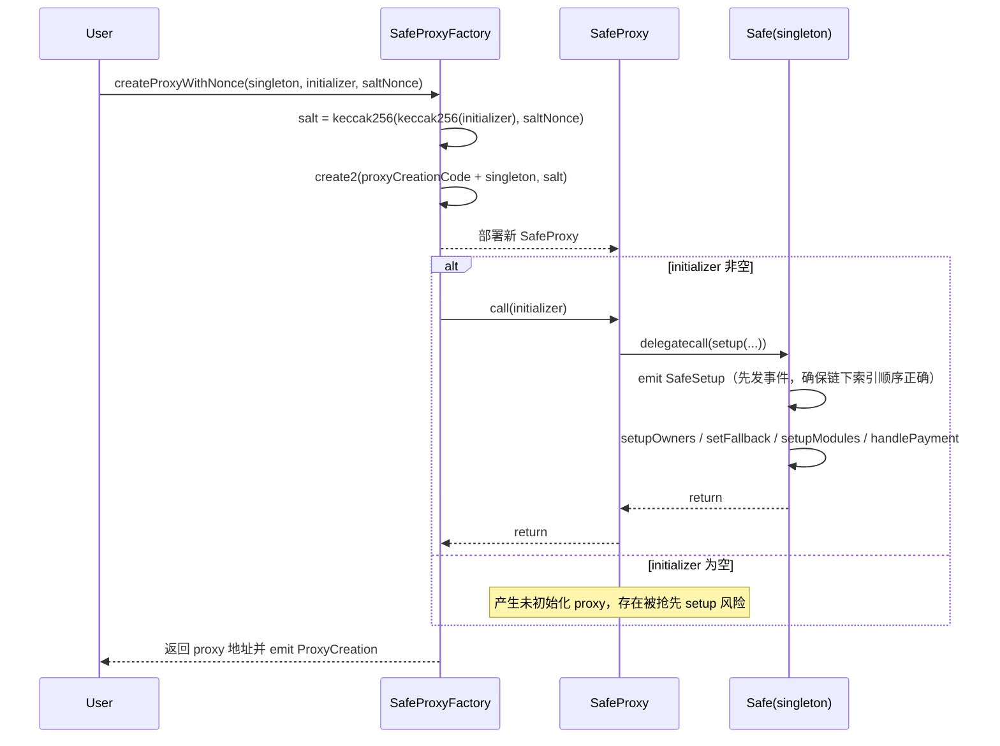

#### 工厂创建接口对照

`SafeProxyFactory` 对外暴露 4 个创建接口。它们的共同点是：**都支持 CREATE2 + 可选 initializer 原子初始化**；差异主要集中在两个维度：

1. **地址语义**：是否把 `chainId` 纳入 salt，从而决定地址是否跨链一致
2. **事件语义**：是否额外发出带 `initializer` / `saltNonce` / `chainId` 的扩展事件，方便链下索引

| 地址策略 \\ 事件策略 | 普通事件 | 扩展事件（L2） |
|---|---|---|
| **跨链同地址** | `createProxyWithNonce` | `createProxyWithNonceL2` |
| **当前链唯一地址** | `createChainSpecificProxyWithNonce` | `createChainSpecificProxyWithNonceL2` |

进一步展开如下：

| 函数 | salt 是否包含 `chainId` | 地址是否可跨链复用 | 额外事件 | 典型用途 |
|---|---:|---:|---|---|
| `createProxyWithNonce` | 否 | 是 | `ProxyCreation` | 标准创建；希望不同链上可得到相同 Safe 地址 |
| `createProxyWithNonceL2` | 否 | 是 | `ProxyCreationL2` | 标准创建，但希望事件里额外记录 `initializer` 与 `saltNonce` |
| `createChainSpecificProxyWithNonce` | 是 | 否 | `ProxyCreation` | 只希望当前链上唯一，不想跨链同地址 |
| `createChainSpecificProxyWithNonceL2` | 是 | 否 | `ChainSpecificProxyCreationL2` | 当前链唯一，同时事件里保留完整创建上下文 |

这里有两个容易混淆的点：

- **`L2` 后缀不影响地址计算**：它只是在普通版基础上多发一个更完整的事件，便于浏览器、索引器、前端恢复部署上下文。
- **真正影响地址的是 `chainId` 是否进入 salt**：`createProxyWithNonce*` 可以跨链复用地址，而 `createChainSpecificProxyWithNonce*` 会把地址绑定到当前链。

#### 选型建议

如果从产品与工程角度做默认选择，可以按下面这套判断：

- **默认优先 `createProxyWithNonceL2`**：
  适合大多数产品化场景。既保留“多链同地址”能力，又让链上事件足够完整，方便索引、排障与审计。
- **使用 `createProxyWithNonce`**：
  当你只关心最简创建流程，不依赖事件恢复创建参数时。
- **使用 `createChainSpecificProxyWithNonce*`**：
  只有在你明确不想要跨链同地址时再使用，比如某条链专用治理 Safe、管理员 Safe、或地址本身带有链内治理语义的场景。
- **带 `L2` 还是普通版**：
  这不是“部署行为”开关，而是“链下可观测性”开关。想让索引器更容易恢复创建上下文，就选带 `L2` 的版本。

归根到底，这 4 个接口并不是 4 种不同的“部署能力”，而是 4 种不同的**地址命名策略 + 事件可观测性策略**组合。

#### CREATE2 Salt 计算图

下图展示了这 4 个接口在 salt 计算上的本质区别：

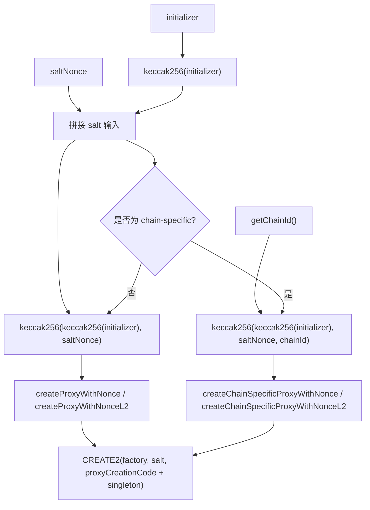

这个图同时说明了两个设计点：

- **`initializer` 必须参与地址计算**：这样地址就和 owners / threshold / fallback handler 等初始化配置强绑定，而不是只和 `saltNonce` 绑定。
- **`chainId` 只在 chain-specific 版本参与计算**：因此它解决的是“地址是否跨链复用”的问题，而不是初始化能力或事件能力的问题。

#### 同一组参数在不同链上的地址结果对比

下面这张图把“同样的 `_singleton`、`initializer`、`saltNonce`”分别放到不同链上，直观看出两类接口的地址语义差异：

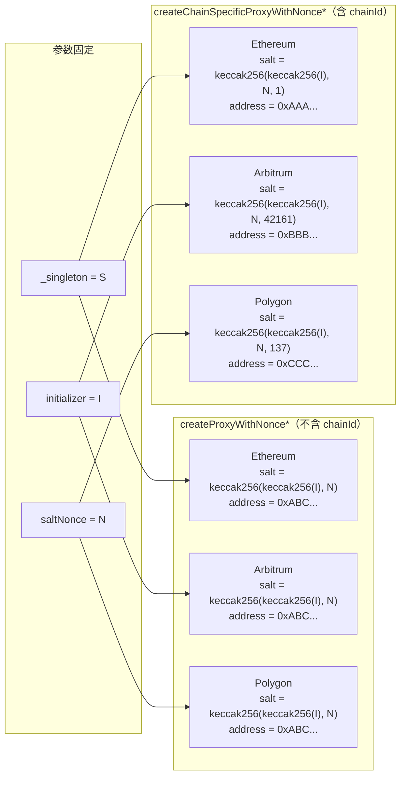

这张图想表达的核心很简单：

- **`createProxyWithNonce*`**：同一组参数在不同链上会导出**相同地址**，适合“跨链统一钱包身份”的产品体验。
- **`createChainSpecificProxyWithNonce*`**：同一组参数在不同链上会导出**不同地址**，适合“每条链都是独立治理实体”的场景。
- `L2` 后缀不改变上面的地址结果，它只影响事件是否带更多创建元数据。

### 3.2 主交易执行

#### `execTransaction` 完整流程

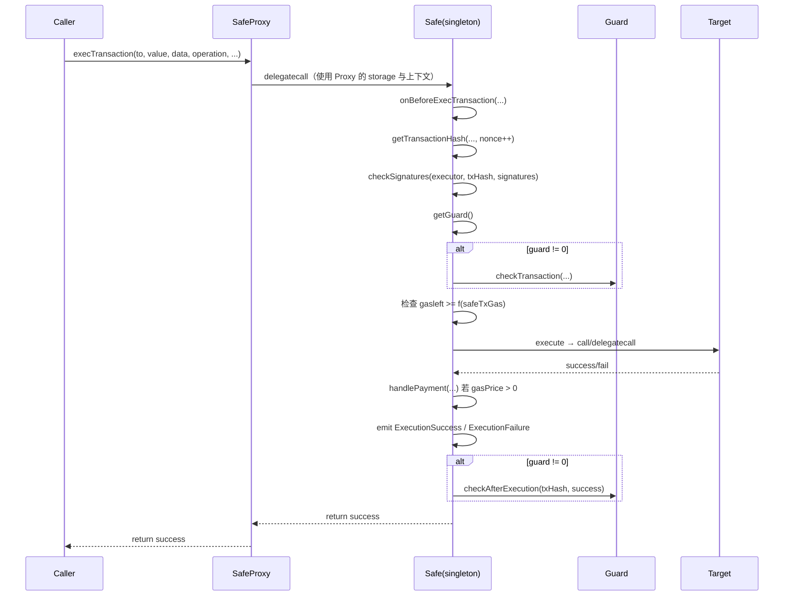

#### 状态流转与回滚机制

下图把 Safe 交易最容易混淆的几类结果拆开：前置检查失败、内部目标调用失败、`estimateGas` 特殊回滚路径、退款阶段失败，以及后置 Guard 否决。

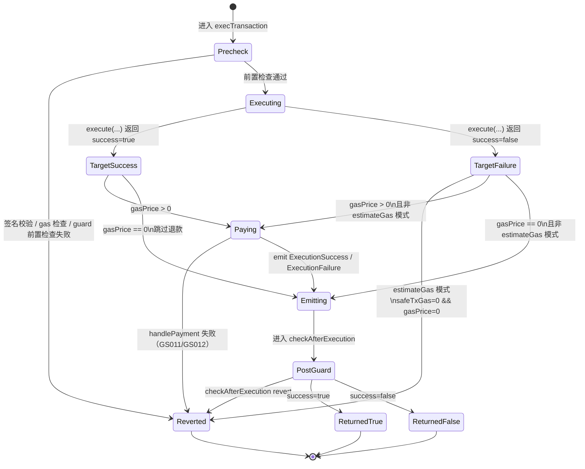

- **签名或前置检查失败**：`revert`，无副作用。
- **estimateGas 特殊模式**：当 `safeTxGas == 0 && gasPrice == 0` 且内部目标调用失败时，Safe 会直接冒泡目标的 revert data，便于链下工具估算最小可执行 gas。
- **内部目标调用失败**：`ReturnedFalse` 表示 Safe 外层调用**成功返回**，但内部目标调用失败。只要不处于 `estimateGas` 模式，且后续逻辑（退款/Guard）未回滚，交易仍可成功上链。
- **退款不是必经阶段**：只有 `gasPrice > 0` 才会进入 `handlePayment`；`gasPrice == 0` 时会跳过退款直接进入事件与后置 Guard。
- **后置 Guard 失败**：`checkAfterExecution` 回滚会连同此前的内部调用效果、退款、事件一起撤销，拥有“最终否决权”。

#### 多签路径 vs 模块路径对照

Safe 中最容易混淆的两条执行路径是 `execTransaction` 与 `execTransactionFromModule`。二者都会落到 `Executor.execute`，但进入执行前的鉴权方式完全不同：

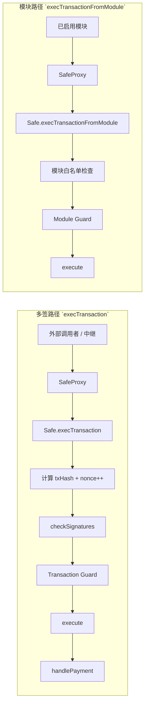

| 维度 | 多签路径 | 模块路径 |
|------|----------|----------|
| 入口 | `execTransaction(...)` | `execTransactionFromModule(...)` |
| 调用者身份 | 任意外部调用者均可提交，但必须附带有效签名 | 仅已启用模块可直接调用 |
| 鉴权依据 | `checkSignatures` / `checkNSignatures` | `modules[msg.sender] != address(0)` 且不是哨兵地址 |
| nonce | 使用，且在计算哈希后自增 | 不使用 |
| Guard | `Transaction Guard` | `Module Guard` |
| 退款 | 支持 `handlePayment` | 不走退款逻辑 |
| 风险特征 | 依赖 owner 签名与阈值控制 | 依赖模块本身的代码质量与访问控制 |

---

## 4. 关键机制

### 4.1 交易哈希与 EIP-712

在进入签名分流之前，先要明确 owner 到底签的是什么。`execTransaction` 并不是直接对原始 calldata 做签名，而是先构造一个 EIP-712 交易哈希：

```text
txHash =
  keccak256(
    0x19 0x01
    || domainSeparator()
    || keccak256(
         abi.encode(
           SAFE_TX_TYPEHASH,
           to,
           value,
           keccak256(data),
           operation,
           safeTxGas,
           baseGas,
           gasPrice,
           gasToken,
           refundReceiver,
           nonce
         )
       )
  )
```

其中有两个关键层次：

- **Domain Separator**：`EIP712Domain(uint256 chainId, address verifyingContract)`，把签名绑定到当前链和当前 Safe 地址，防止跨链或跨 Safe 重放。
- **SafeTx 结构体哈希**：把一笔 Safe 交易的全部关键参数编码后再哈希，其中 `bytes data` 不直接参与编码，而是先做 `keccak256(data)`。

可以把这套结构理解为：

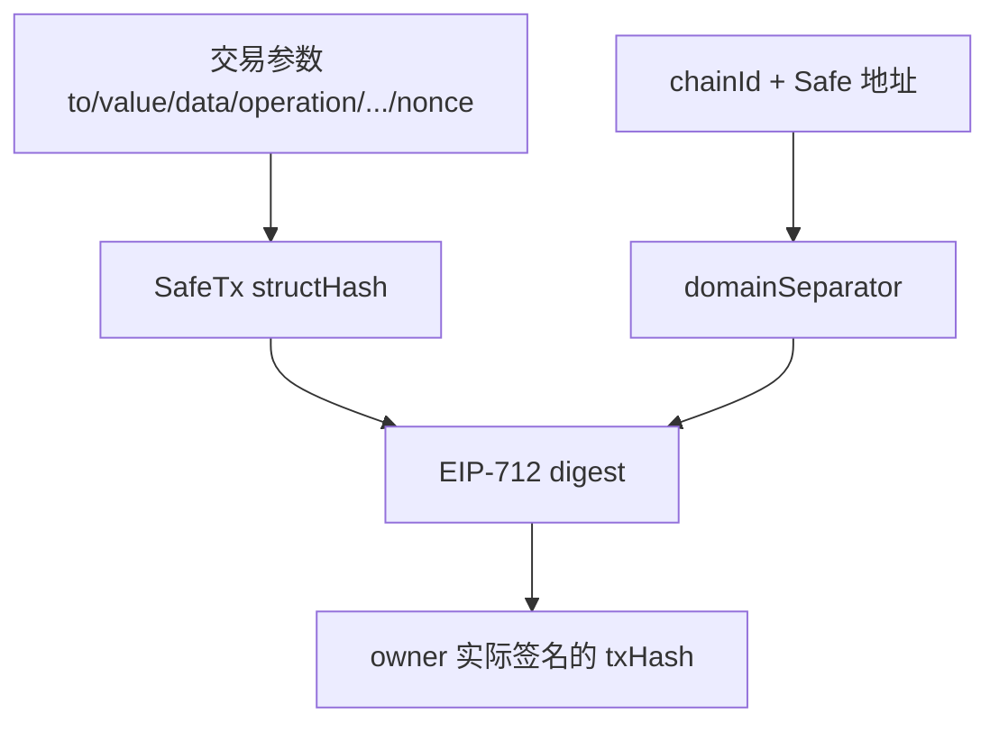

这也是为什么 Safe 的签名校验天然具备三层约束：
- 交易参数不能被修改，否则 `SafeTx structHash` 改变；
- 不能跨链复用，否则 `chainId` 改变；
- 不能在另一个 Safe 上复用，否则 `verifyingContract` 改变。

### 4.2 签名验证系统

#### 签名的整体结构（编码协议）

Safe 支持多种签名类型，所有签名在传入合约时被**合并成单一的 `bytes` 参数**，随 `execTransaction` 调用一同提交。

**基本规则：**
- 每条签名有**固定的 65 字节头部**：`{64 字节签名数据}{1 字节签名类型（v）}`
- 若某种签名类型需要额外动态数据（如 EIP-1271 的验证字节流），则追加到所有固定头部的末尾，用偏移量（offset）定位。
- **所有签名必须按签名者地址升序（非 checksum 格式）拼接**，`checkNSignatures` 依赖此规则做去重检查。

| 签名类型 | `v` 值 | 固定部分结构 | 动态部分 |
|---|---|---|---|
| ECDSA（标准） | 27 或 28 | `{r(32)}{s(32)}{v(1)}` | 无 |
| `eth_sign` | > 30（实际 v+4） | `{r(32)}{s(32)}{v(1)}` | 无 |
| 合约签名（EIP-1271） | 0 | `{verifier地址(32)}{动态数据偏移(32)}{0x00(1)}` | `{数据长度(32)}{签名字节流}` |
| 预验证签名 | 1 | `{validator地址(32)}{忽略(32)}{0x01(1)}` | 无 |
| P-256（EIP-7951） | 2 | `{声明的owner(32)}{动态数据偏移(32)}{0x02(1)}` | `{sig_r}{sig_s}{qx}{qy}` |

#### 各类型签名详解

**ECDSA 签名（v = 27/28）**

标准的 `ecrecover` 路径。`r`、`s`、`v` 三者合计 65 字节，无需动态数据。合约直接调用 `ecrecover(txHash, v, r, s)` 恢复出签名者地址，与 owner 列表比对。

**`eth_sign` 签名（v > 30）**

`eth_sign` 会在消息哈希前自动拼接 EIP-191 前缀（`"\x19Ethereum Signed Message:\n32"`）再签名。为了让合约能识别这个分支，签名者在构造时将原始 `v`（27/28）加 4，传入合约后再减 4 还原，再以 EIP-191 前缀哈希为输入调用 `ecrecover`。

**合约签名 EIP-1271（v = 0）**

适用于签名者本身是一个合约（如另一个 Safe）。
- 固定部分：`r` 字段存放 verifier 合约地址，`s` 字段存放指向动态区的偏移量。
- 动态部分：追加在所有固定头部之后，包含实际的签名字节流，由 verifier 合约的 `isValidSignature` 方法消费。
- 也可以通过 `signMessage` 在链上将某条消息标记为"已全员同意"，省去动态字节流。

**预验证签名（v = 1）**

无需在调用时提交签名内容，而是依赖**链上提前记录**：
- 某个 owner 调用 `approveHash(txHash)` 后，`approvedHashes[owner][txHash] = 1`，之后这条记录即可充当签名。
- 若 `executor`（即发起 `execTransaction` 的 `msg.sender`）本身是 owner，则无需预先 `approveHash`，合约自动认为其已授权。
- 固定部分：`r` 字段存放 validator 地址，`s` 字段填充为 0（忽略）。

#### `checkNSignatures` 验证流程

`checkNSignatures` 是 Safe 多签验证的核心枢纽。它逐条读取 `signatures` 中的 65 字节静态头部，并按 `v` 值决定后续验证路径：

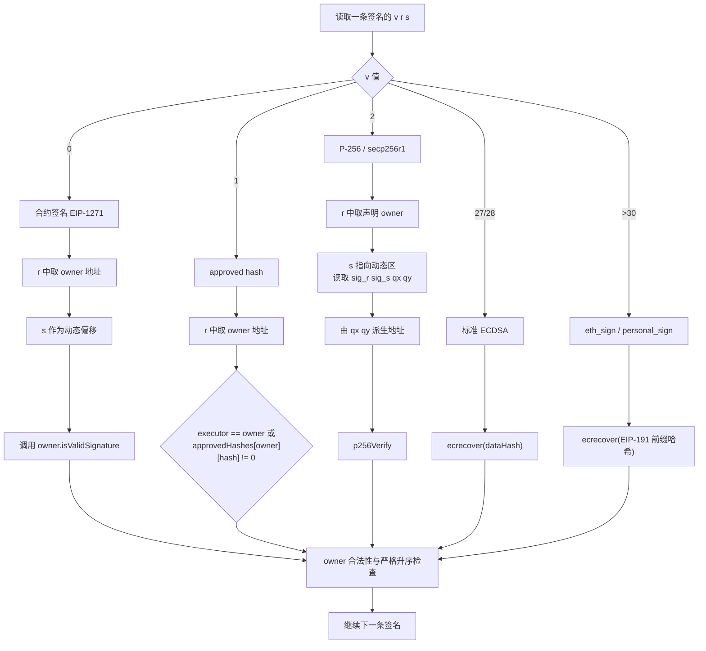

- **EIP-7951 / RIP-7212（P-256）**：Safe 在 `v = 2` 的签名分支中调用 `address(0x100)` 预编译验证 secp256r1（P-256）签名。
- **EIP-7702**：`OwnerManager` 继承 `EIP7702`，用于检测当前执行是否处于 delegated account 上下文。

#### 完整签名字节流示例

假设一笔 2/3 多签交易，三个签名者分别用 ECDSA、EIP-1271 合约签名和预验证签名，最终传入 `execTransaction` 的 `signatures` 参数（签名者地址 `0x1 < 0x2 < 0x3`，按升序排列）如下：

```text
"0x" +
// 签名者 0x1：EIP-1271 合约签名（固定部分，v=0）
"000000000000000000000000000000000000000000000000000000000000000100000000000000000000000000000000000000000000000000000000000000c300" +
// 签名者 0x2：预验证签名（固定部分，v=1）
"0000000000000000000000000000000000000000000000000000000000000002000000000000000000000000000000000000000000000000000000000000000001" +
// 签名者 0x3：标准 ECDSA 签名（固定部分，v=0x1c=28）
"bde0b9f486b1960454e326375d0b1680243e031fd4fb3f070d9a3ef9871ccfd57d1a653cffb6321f889169f08e548684e005f2b0c3a6c06fba4c4a68f5e006241c" +
// EIP-1271 动态数据（length + data）
"000000000000000000000000000000000000000000000000000000000000000800000000000000000000000000000000000000000000000000000000deadbeef"
```

### 4.3 Gas 与费用机制

Safe 的 gas 设计要同时解决两个问题：

1. **如何控制 Safe 内部那次真正的目标调用消耗多少 gas**
2. **如果交易由 relayer 代发，Safe 如何安全地补偿执行成本**

因此，`SafeTx` 中除了业务参数 `to/value/data/operation` 外，还额外引入了 `safeTxGas`、`baseGas`、`gasPrice`、`gasToken`、`refundReceiver` 五个“执行预算 + 费用结算”字段。

#### 关键字段总览

| 字段 | 作用 | 什么时候生效 | 典型设置 |
|------|------|--------------|----------|
| `safeTxGas` | Safe 内部执行目标调用时使用的 gas 预算 | `execute(...)` 阶段 | relayer 场景下精确设置；估算模式可设 `0` |
| `baseGas` | 不属于目标调用本身、但应计入补偿的固定 gas 成本 | `handlePayment(...)` 阶段 | 由 SDK/前端估算签名校验、交易数据等开销 |
| `gasPrice` | 退款单价，同时也是“是否退款”的开关 | `gasPrice > 0` 时进入退款逻辑 | owner 自发交易通常设 `0`，relayer 模式设正值 |
| `gasToken` | 退款使用的资产 | `handlePayment(...)` 阶段 | `address(0)` 表示原生币，非零表示 ERC20 |
| `refundReceiver` | 退款接收人 | `handlePayment(...)` 阶段 | 通常是 relayer；为 `0` 时退给 `tx.origin` |

可以把这五个字段理解为一份由 owner 预先签名确认的“费用协议”：

- **执行预算**：这笔 Safe 交易内部最多打算消耗多少 gas（`safeTxGas`）
- **固定成本**：除了目标调用本身，还要把哪些外层成本一起算进去（`baseGas`）
- **结算价格**：按什么单价报销（`gasPrice`）
- **结算资产**：用 ETH 还是 ERC20 付（`gasToken`）
- **收款地址**：补偿打给谁（`refundReceiver`）

#### 在 `execTransaction` 中的生效顺序

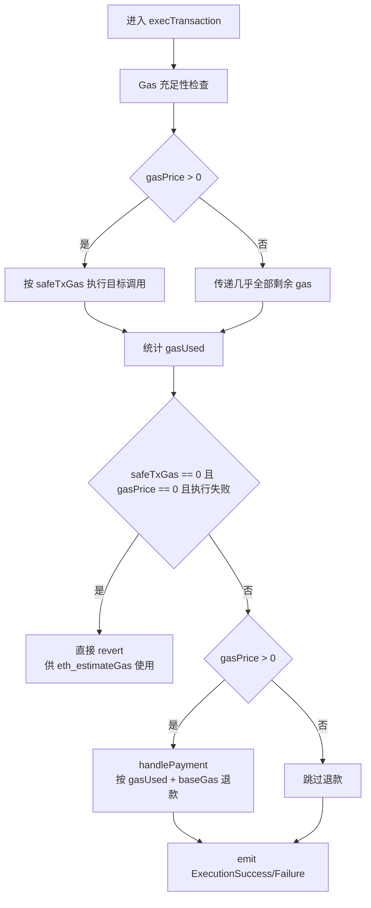

这张图反映了一个核心事实：**`safeTxGas` 主要影响执行阶段，`baseGas/gasPrice/gasToken/refundReceiver` 主要影响退款阶段。**

#### 退款公式与两种支付模式

Safe 的退款逻辑统一在 `handlePayment(...)` 中：

- **原生币模式**：`payment = (gasUsed + baseGas) * min(gasPrice, tx.gasprice)`
- **ERC20 模式**：`payment = (gasUsed + baseGas) * gasPrice`

之所以 ETH 模式取 `min(gasPrice, tx.gasprice)`，是为了防止 relayer 人为把链上 `tx.gasprice` 设得极高，从而多拿退款；而 ERC20 模式下，链上无法知道该 token 与 gas 成本的真实汇率，因此只能直接按签名里约定的 `gasPrice` 计算。

#### `safeTxGas` 的三种常见语义

**1. `gasPrice > 0`：退款模式**

- Safe 会严格按 `safeTxGas` 去执行内部目标调用。
- 这样 relayer 无法通过“多传 gas、故意多烧 gas”来提高可报销金额。
- 即使内部目标调用失败，只要外层 `execTransaction` 没有整体回滚，Safe 仍会支付退款。
- 失败交易的 `nonce` 依然会消耗，因此不能原样重试。

**2. `gasPrice == 0 && safeTxGas > 0`：无退款、但指定最低执行预算**

- Safe 不会报销 gas，通常表示 owner 自己发交易。
- 这时 `safeTxGas` 更像一个“最低可用 gas 下界”，Safe 在执行前仍会检查外层 gas 是否足够。
- 若设置过低，内部调用可能 OOG，但 nonce 仍会前进，导致该笔签名交易无法再次原样执行。

**3. `gasPrice == 0 && safeTxGas == 0`：估算友好模式**

- Safe 会把几乎所有剩余 gas 都传给内部调用。
- 如果内部调用失败，Safe 不会吞掉错误，而是直接冒泡 revert data。
- 这样钱包或 SDK 调用 `eth_estimateGas` 时，就能更准确地找到“刚好成功”的最小 gas。
- 由于整笔交易回滚，这种失败不会消耗 nonce，因此未来仍可重试。

#### `baseGas` 为什么单独存在

`baseGas` 的意义在于：**退款不应只覆盖目标合约执行成本，还应覆盖 Safe 框架本身的外层成本。**

典型包括：

- EIP-712 哈希与签名校验
- 交易 calldata 的基础开销
- Guard 前后检查
- 退款计算与转账本身的开销

如果没有 `baseGas`，relayer 只能拿回目标调用内部消耗的 gas，而 Safe 在签名校验和外围流程上的消耗会变成 relayer 的净损失，元交易模式就难以成立。

#### 两种典型使用场景

| 场景 | 推荐设置 | 效果 |
|------|----------|------|
| owner 自己提交交易 | `gasPrice = 0`，`gasToken = 0`，`refundReceiver = 0` | 不退款，自己承担链上 gas |
| relayer 代发交易 | `gasPrice > 0`，`refundReceiver = relayer` | Safe 用 ETH 或 ERC20 补偿执行者 |

#### 常见误区

- `safeTxGas` **不是**外层以太坊交易的 gas limit，而是 **Safe 内部调用目标合约时的 gas 参数**。
- `gasPrice = 0` 并不表示“这笔交易不消耗 gas”，只表示 **Safe 不会报销**。
- `refundReceiver = 0` 并不是“不退款”，而是 **默认退给 `tx.origin`**。
- 使用 ERC20 退款时，`gasPrice` 本质上是 owner 与 relayer 事先协商好的结算单价，不代表链上真实市场价格。

#### 外层交易 gas limit vs Safe 内部 `safeTxGas`

这两个概念很容易混淆，但它们属于**两层不同的调用上下文**：

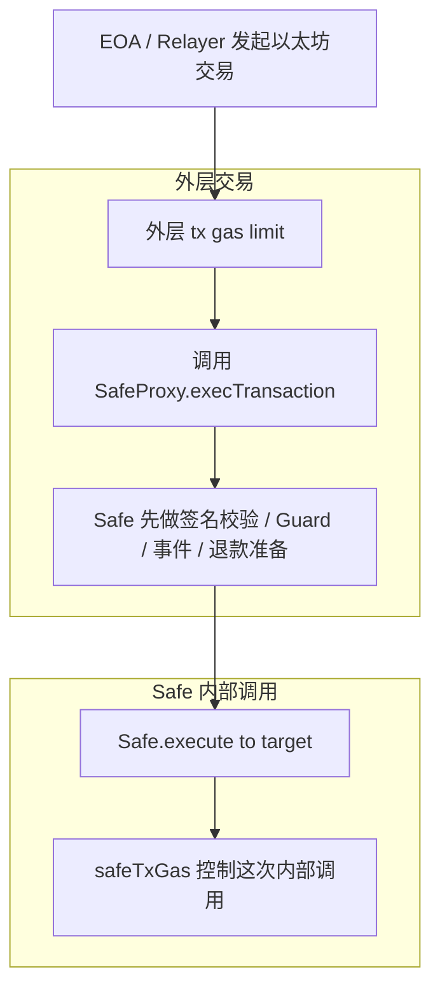

可以用一句话区分：

- **外层 tx gas limit**：EOA 或 relayer 发给 `SafeProxy` 这笔链上交易，最多愿意消耗多少 gas。
- **`safeTxGas`**：Safe 在内部真正调用目标合约 `to` 时，打算分配多少 gas 给这次 `CALL/DELEGATECALL`。

二者的关系是：

- 外层 gas limit 必须**覆盖整个 Safe 流程**：签名校验、Guard、事件、退款、以及最后的目标调用。
- `safeTxGas` 只覆盖**最内层目标调用**，不包含签名验证与退款逻辑本身。
- 因此，即便 `safeTxGas = 100000`，外层交易 gas limit 也通常要远大于 `100000`。
- 当 `gasPrice > 0` 时，Safe 为了防止 relayer 通过“多烧 gas”多拿补偿，会严格按 `safeTxGas` 执行内部调用。
- 当 `gasPrice == 0` 时，Safe 对内部调用的 gas 控制会宽松很多；若同时 `safeTxGas == 0`，则基本进入“把剩余 gas 都传下去”的估算友好模式。

#### 模拟执行（Simulation）与 Gas 估算

- `StorageAccessible.simulateAndRevert(target, calldata)` 通过 `delegatecall` 在 Safe 的 storage 上下文中执行**任意目标逻辑**，但不会正常返回，而是把 `success + returndata` 编码进 revert 数据再回滚。
- `SimulateTxAccessor` 是专门给 `simulateAndRevert` 搭配使用的辅助合约：它内部复用 `Executor.execute` 执行一次 `(to, value, data, operation)`，常被前端、SDK 或调试工具用来预演一次 Safe 风格的调用结果，而不只是服务于 `execTransaction` 单一路径。
- 因此，Safe 的 gas 体验通常是“先模拟/估算，再生成签名参数，再正式执行”。

### 4.4 Fallback 体系

未匹配到函数时进入 `FallbackManager.fallback()`，从 `FALLBACK_HANDLER_STORAGE_SLOT` 读取处理器地址，将 **calldata + msg.sender（20 字节）** 拼在一起再 `call(handler)`。注意：此 `call` 的 **value 为 0**，即随 fallback 发送给 Safe 的 ETH 不会被转发到处理器。

#### 两类处理器的区别

当前仓库里主要有两类 fallback 处理器：一类用于兼容旧接口，另一类用于按 Safe 维度做可扩展路由：

| 维度 | `CompatibilityFallbackHandler` | `ExtensibleFallbackHandler` |
|------|-------------------------------|-----------------------------|
| 设计目标 | 兼容 pre-1.3.0 与 1.3.0+ Safe 的常见接口 | 提供可配置、按 selector 路由的扩展式处理器 |
| ERC-1271 | 支持，走默认 Safe message 校验路径 | 支持，且可通过 `SignatureVerifierMuxer` 做 domain 级分流 |
| Token 回调 | 支持 ERC-721 / ERC-1155 / ERC-777 | 支持 ERC-721 / ERC-1155，不含 ERC-777 |
| 模拟执行 | 内置 `simulate(targetContract, calldataPayload)` | 不内置该兼容接口 |
| 交易哈希辅助 | 提供 `encodeTransactionData(...)` | 不提供该兼容接口 |
| 路由能力 | 固定接口集合 | 支持 `setSafeMethod(selector, newMethod)` 做 Safe 级别路由 |
| ERC-165 | 仅基础 token callback 接口 | 通过 `ERC165Handler` 支持标准接口声明与批量注册 |
| 典型适用场景 | 老生态兼容、通用钱包工具支持 | 高度定制的 Safe 扩展、模块化 fallback 体系 |

#### Extensible Fallback Handler 机制

`ExtensibleFallbackHandler` 由多个组件组合而成，核心作用是按 selector 和 Safe 维度做路由：

- `FallbackHandler`：提供通用 fallback 入口；按 `msg.sig` 查找当前 Safe 对应的方法处理器。
- `ExtensibleBase`：维护 `safeMethods[safe][selector]` 路由表，并通过 `HandlerContext` 恢复原始调用者。
- `MarshalLib`：编解码处理器元数据（isStatic + address）。
- `SignatureVerifierMuxer`：为不同 `domainSeparator` 绑定不同 verifier。
- `ERC165Handler`：支持 ERC-165 接口声明与批量注册。

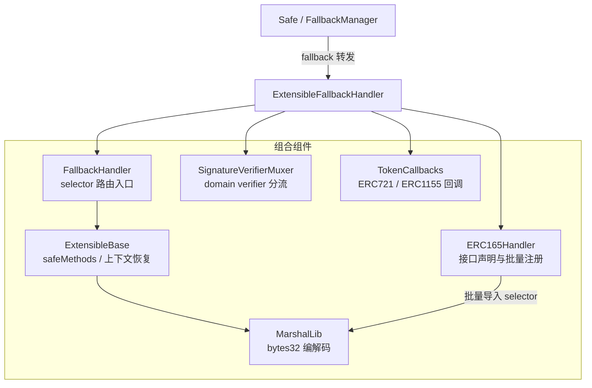

---

## 5. 扩展系统：Module 与 Guard

### 5.1 模块执行

模块执行路径与 owner 多签路径不同。它不经过 `checkSignatures` 与 nonce，而是直接检查当前调用者是否已经出现在模块链表中：

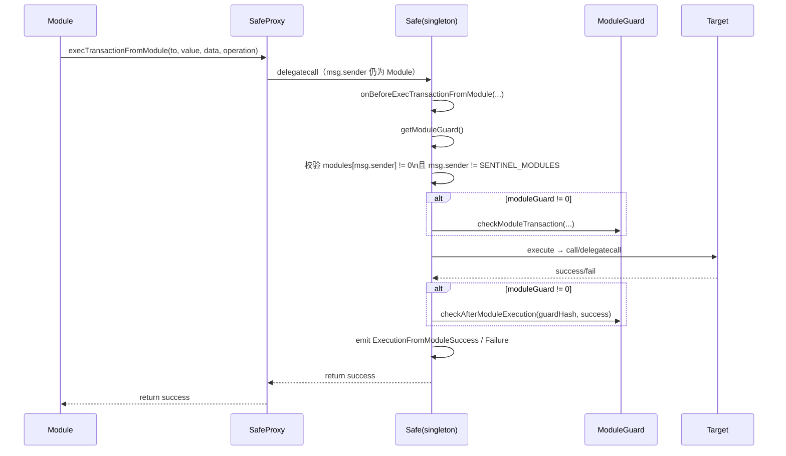

- 仅允许已启用模块调用：`msg.sender != SENTINEL_MODULES && modules[msg.sender] != address(0)`（排除哨兵地址 0x1）。
- 使用 `Executor.execute`，gas 传 `type(uint256).max`，不限制 Safe 侧 gas。
- 模块不走多签校验，也不检查 nonce；它是一条预先授权的执行通道。
- `execTransactionFromModuleReturnData` 与上图主流程相同，只是在 `execute` 之后额外拷贝 `returndata` 并返回。

### 5.2 Guard 机制

- **Transaction Guard**：作用于 `execTransaction`，拥有前置检查（`checkTransaction`）和后置检查（`checkAfterExecution`）能力。
- **Module Guard**：作用于 `execTransactionFromModule`，拥有类似的 `checkModuleTransaction` 和 `checkAfterModuleExecution` 能力。

### 5.3 权限风险矩阵

| 组件 | 挂载方式 | 触发时机 | 能否主动发起调用 | 能否阻止交易 | 对 Safe 存储/权限面的影响 | 主要风险 |
|------|----------|----------|------------------|--------------|---------------------------|----------|
| `Module` | `enableModule()` | 模块自行调用 `execTransactionFromModule` | **可以**。可让 Safe 执行任意 `CALL/DELEGATECALL` | 间接可以。模块本身可选择不发起 | **最高**。本质上获得接近 Safe 自身的执行权限 | 恶意模块可转走资产、改配置、执行任意 delegatecall |
| `Transaction Guard` | `setGuard()` | 每次 `execTransaction()` 前后 | 不可以 | **可以**。前置或后置检查均可回滚整笔交易 | 对 Safe 主流程有强约束力 | 守卫逻辑写错会造成永久 DoS；后置回滚撤销所有执行结果 |
| `Module Guard` | `setModuleGuard()` | 每次 `execTransactionFromModule` 前后 | 不可以 | **可以**。阻止模块交易 | 仅约束模块路径 | 若规则失当，可能让模块路径失效 |
| `Fallback Handler` | `setFallbackHandler()` | Safe 未匹配函数选择器时 | 不可以 | 不属于“审批交易”的阻止器 | 取决于 handler 设计 | 错误 handler 可能暴露额外入口或误解析拼接 calldata |

---

## 6. 存储布局

### 6.1 关键 slot 分布

Safe 采用固定的存储布局，以支持 Proxy 模式、工具库复用以及版本迁移场景中的兼容性。

#### 合约与存储的对应关系

下图展示 `SafeProxy` 和 `Safe`（singleton）如何通过 `delegatecall` 共用同一份 storage，以及每个 slot 来自哪个合约/继承层：

```
  SafeProxy 合约                       Safe 合约（singleton，仅提供逻辑）
  ──────────────────                   ─────────────────────────────────────────────
  contract SafeProxy {                 contract Safe is
    address singleton; // slot 0         Singleton,          // slot 0: singleton（占位对齐）
  }                                      ModuleManager,      // slot 1: modules mapping
                                         OwnerManager,       // slot 2: owners mapping
                                         ...                 // slot 3: ownerCount
                                         ...                 // slot 4: threshold
                                         ...                 // slot 5: nonce
                                         ...                 // slot 6: _deprecatedDomainSeparator
                                         ...                 // slot 7: signedMessages
                                         ...                 // slot 8: approvedHashes

         │                                         │
         │        delegatecall（逻辑在 Safe）        │
         ╰──────────────────────────────────────────╯
                         ↓
         实际读写的是 SafeProxy 的 storage
         Safe 的逻辑以 Proxy 的 storage 为上下文执行
```

**关键约束**：`Safe` 继承链中 `Singleton` 必须排第一，因为它的 `slot 0` 必须与 `SafeProxy.singleton` 精确对齐。一旦继承顺序改变，`delegatecall` 就会把 `singleton` 地址写进错误的 slot，导致 Proxy 指向混乱。

#### EVM Storage 布局全图

```
EVM Storage（SafeProxy 上下文）
┌────────┬──────────────────────────────────────┬───────────────────────────────────┐
│  Slot  │ 变量名                               │ 来源合约 / 说明                    │
├────────┼──────────────────────────────────────┼───────────────────────────────────┤
│   0    │ singleton (address)                  │ SafeProxy / Singleton（必须首位）  │
│        │                                      │ ← Proxy 与 Safe 共用，对齐关键点   │
├────────┼──────────────────────────────────────┼───────────────────────────────────┤
│   1    │ modules (mapping)                    │ ModuleManager（via SafeStorage）   │
├────────┼──────────────────────────────────────┼───────────────────────────────────┤
│   2    │ owners (mapping)                     │ OwnerManager（via SafeStorage）    │
├────────┼──────────────────────────────────────┼───────────────────────────────────┤
│   3    │ ownerCount (uint256)                 │ OwnerManager                       │
├────────┼──────────────────────────────────────┼───────────────────────────────────┤
│   4    │ threshold (uint256)                  │ OwnerManager                       │
├────────┼──────────────────────────────────────┼───────────────────────────────────┤
│   5    │ nonce (uint256)                      │ Safe.execTransaction 自增          │
├────────┼──────────────────────────────────────┼───────────────────────────────────┤
│   6    │ _deprecatedDomainSeparator (bytes32) │ 废弃，仅占位保证布局向前兼容       │
├────────┼──────────────────────────────────────┼───────────────────────────────────┤
│   7    │ signedMessages (mapping)             │ 链上已全签消息哈希                 │
├────────┼──────────────────────────────────────┼───────────────────────────────────┤
│   8    │ approvedHashes (mapping)             │ owner 预批准哈希（v=1 签名路径）   │
├────────┴──────────────────────────────────────┴───────────────────────────────────┤
│  随机 Slot（keccak256 哈希，避免与顺序 slot 碰撞）                                 │
├────────────────────────┬─────────────────────┬───────────────────────────────────┤
│ 0x6c9a...18d5          │ Fallback Handler    │ keccak256("fallback_manager...")   │
│ 0x4a20...34c8          │ Transaction Guard   │ keccak256("guard_manager...")      │
│ 0xb104...9947          │ Module Guard        │ keccak256("module_manager...")     │
└────────────────────────┴─────────────────────┴───────────────────────────────────┘
```

> **为什么 Fallback Handler / Guard 用随机 Slot？**
> 这三个地址是在 Safe v1.x 演进过程中后加入的扩展字段。如果直接追加为 slot 9/10/11，在使用旧布局的迁移场景或工具库（如 `SafeStorage`）中，继承顺序一旦不同就会产生 slot 错位（storage collision）。用 `keccak256(string)` 确定一个几乎不可能与顺序 slot 碰撞的地址，是 EIP-1967 引入的最佳实践，Safe 在扩展字段上沿用了同样的思路。

### 6.2 链表管理

所有者和模块列表均使用 **单向链表 + Mapping** 实现：
- `owners[SENTINEL_OWNERS]` 指向第一个 owner。
- `owners[owner]` 指向下一个 owner。
- `owners[last_owner]` 指回 `SENTINEL_OWNERS`。
- 增删改均为 O(1)，且支持 `prev + current` 校验防止并发修改冲突。

---

## 7. 开发者参考

### 7.1 常见错误码索引

| 错误码 | 典型触发位置 | 含义 |
|--------|--------------|------|
| `GS000` | `ModuleManager.setupModules` | setup 阶段对初始化模块的 `delegatecall` 执行失败 |
| `GS001` | `Safe.checkSignatures` | Safe 尚未初始化，`threshold == 0` |
| `GS002` | `ModuleManager.setupModules` | setup 传入的 `to` 不是合约地址 |
| `GS010` | `Safe.execTransaction` | 剩余 gas 不足 |
| `GS011` | `Safe.handlePayment` | 原生币退款失败 |
| `GS012` | `Safe.handlePayment` | ERC20 退款失败 |
| `GS020` | `Safe.checkNSignatures` | 签名总长度不足 |
| `GS021` | `Safe.checkNSignatures` | 动态签名偏移指向静态区 |
| `GS022` | `Safe.checkContractSignature` | 合约签名偏移读取越界 |
| `GS023` | `Safe.checkContractSignature` | 合约签名动态数据越界 |
| `GS024` | `Safe.checkContractSignature` | EIP-1271 验证失败 |
| `GS025` | `Safe.checkNSignatures` | v=1 签名未批准且 executor 非 owner |
| `GS026` | `Safe.checkNSignatures` | owner 非法、重复或未排序 |
| `GS027` | `Safe.checkNSignatures` | P-256 动态签名数据越界 |
| `GS028` | `Safe.checkNSignatures` | P-256 验签失败 |
| `GS030` | `Safe.approveHash` | 非 owner 调用 `approveHash` |
| `GS031` | `SelfAuthorized.authorized` | 非自调用 |
| `GS100` | `ModuleManager.setupModules` | 模块链表重复初始化 |
| `GS101` | `ModuleManager.enable/disableModule` | 模块地址为 `0` 或哨兵地址 |
| `GS102` | `ModuleManager.enableModule` | 模块重复添加 |
| `GS103` | `ModuleManager.disableModule` | `prevModule` 与 `module` 链表关系不匹配 |
| `GS104` | `ModuleManager.preModuleExecution` | 调用者不是已启用模块 |
| `GS105` | `ModuleManager.getModulesPaginated` | 分页起点非法 |
| `GS106` | `ModuleManager.getModulesPaginated` | `pageSize == 0` |
| `GS200` | `OwnerManager.setupOwners` | owner/threshold 已初始化，重复 setup |
| `GS201` | `OwnerManager.setupOwners/changeThreshold/removeOwner` | threshold 大于 owner 数量 |
| `GS202` | `OwnerManager.setupOwners/changeThreshold` | threshold 不能为 0 |
| `GS203` | `OwnerManager.requireIsValidOwner`（由 `requireCanAddOwner` / `requireCanRemoveOwner` 调用） | owner 地址非法（如 0、哨兵、非允许场景下的 self） |
| `GS204` | `OwnerManager.setupOwners/requireCanAddOwner` | owner 重复 |
| `GS205` | `OwnerManager.requireCanRemoveOwner`（由 `removeOwner` / `swapOwner` 调用） | `prevOwner` 与待删 owner 链表关系不匹配 |
| `GS300` | `GuardManager.setGuard` | guard 不支持 `ITransactionGuard` 接口 |
| `GS301` | `ModuleManager.setModuleGuard` | module guard 不支持 `IModuleGuard` 接口 |
| `GS400` | `FallbackManager.internalSetFallbackHandler` | fallback 处理器被设置为 Safe 自身 |

### 7.2 核心函数索引

| 函数 / 入口 | 所在文件 | 作用 |
|------------|----------|------|
| `setup(...)` | `contracts/Safe.sol` | Safe 一次性初始化入口 |
| `execTransaction(...)` | `contracts/Safe.sol` | 多签主入口 |
| `checkSignatures(...)` | `contracts/Safe.sol` | 签名验证入口 |
| `checkNSignatures(...)` | `contracts/Safe.sol` | Safe 核心签名分流器，按 `v` 值切换 ECDSA / EIP-1271 / approved hash / P-256 路径 |
| `approveHash(...)` | `contracts/Safe.sol` | owner 预批准某个 hash，供 `v = 1` 签名路径使用 |
| `execTransactionFromModule(...)` | `contracts/base/ModuleManager.sol` | 模块执行入口 |
| `execTransactionFromModuleReturnData(...)` | `contracts/base/ModuleManager.sol` | 模块执行并返回 `returndata` |
| `setFallbackHandler(...)` | `contracts/base/FallbackManager.sol` | 设置 fallback 处理器 |
| `simulateAndRevert(...)` | `contracts/common/StorageAccessible.sol` | 在 Safe 上下文中模拟执行并把结果编码进 revert data |
| `simulate(...)` | `contracts/accessors/SimulateTxAccessor.sol` | 与 `simulateAndRevert` 配合使用的执行器 |
| `setSafeMethod(...)` | `contracts/handler/extensible/FallbackHandler.sol` | 为指定 selector 配置 extensible fallback 路由 |
| `setDomainVerifier(...)` | `contracts/handler/extensible/SignatureVerifierMuxer.sol` | 为某个 `domainSeparator` 绑定 verifier |
| `addSupportedInterfaceBatch(...)` | `contracts/handler/extensible/ERC165Handler.sol` | 批量注册 interface 的 selector 路由并启用 ERC-165 声明 |
| `createProxyWithNonce(...)` | `contracts/proxies/SafeProxyFactory.sol` | 使用 CREATE2 部署 proxy，并可原子化执行 initializer |
| `fallback()` | `contracts/proxies/SafeProxy.sol` | Proxy 转发入口 |

### 7.3 相关工具库

- **SafeToL2Setup**：用于“跨网络同地址部署”，在 setup 阶段通过 `delegatecall` 将实现合约从 `Safe` 切换到 `SafeL2`。
- **MultiSend**：支持在一次打包调用中混合执行 `CALL` 与 `DELEGATECALL`。
- **MultiSendCallOnly**：仅支持 `CALL` 的批量执行工具，适合不希望批量载荷获得 Safe 上下文写权限的场景。

---

## 源码引用

| 项目 | 信息 |
|------|------|
| **仓库** | [safe-fndn/safe-smart-account](https://github.com/safe-fndn/safe-smart-account) |
| **版本** | v1.5.0 |
| **Commit** | [`a2e19c6`](https://github.com/safe-fndn/safe-smart-account/commit/a2e19c6aa42a45ceec68057f3fa387f169c5b321) |
| **License** | LGPL-3.0 |

*本报告基于上述 commit 的源码整理，若需与某次发布版本严格对应，请以该版本 tag 为准。*
