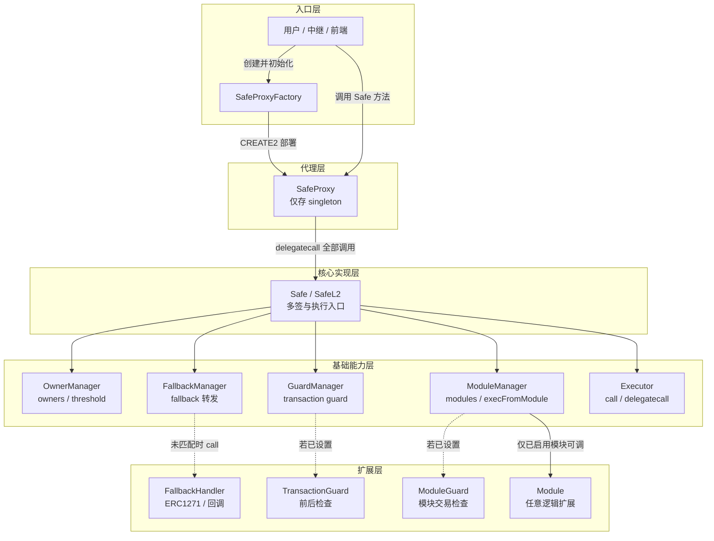
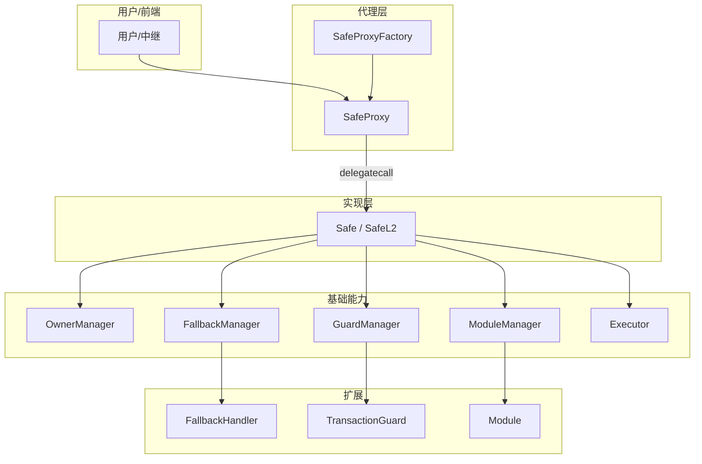
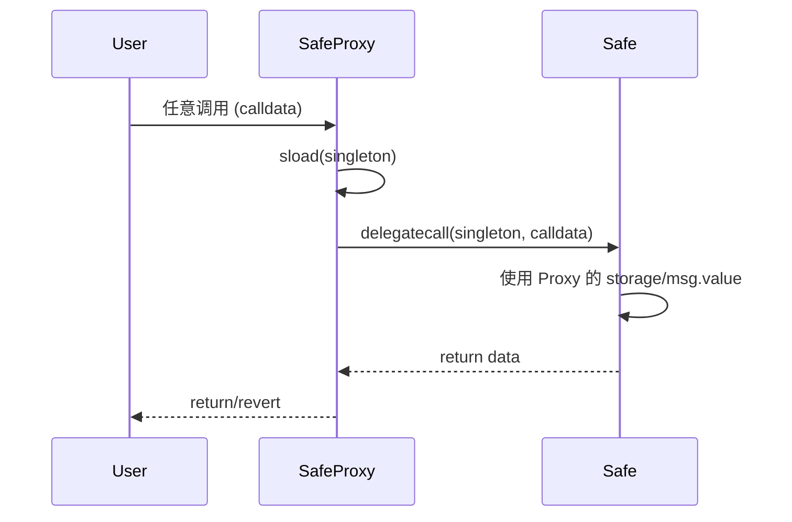
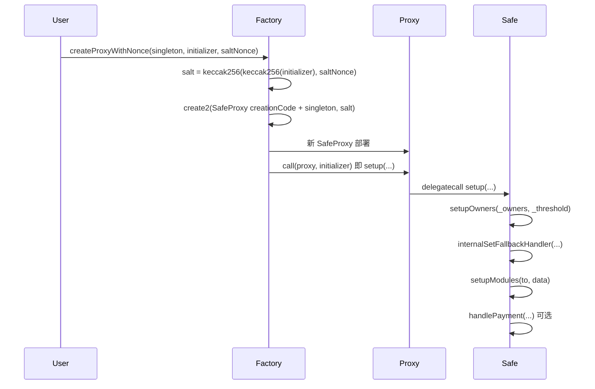
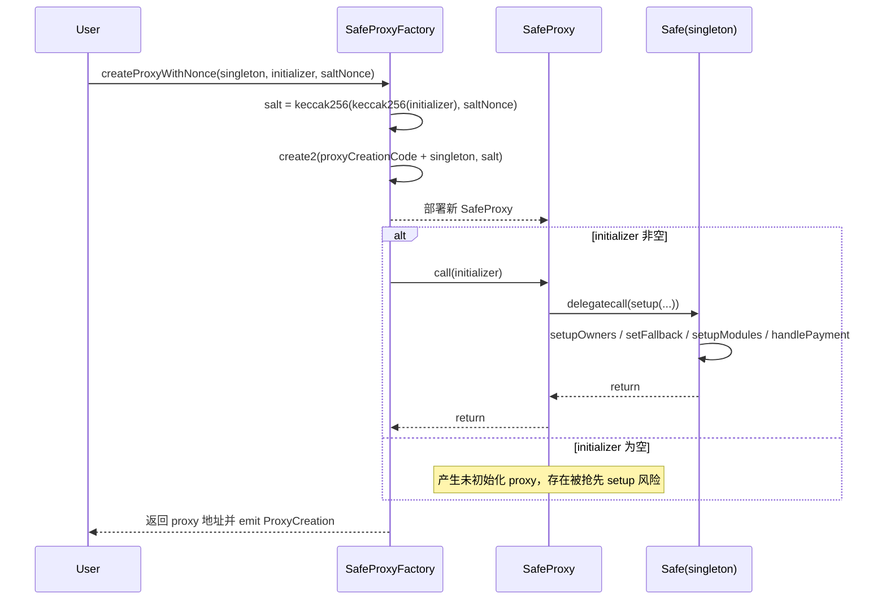
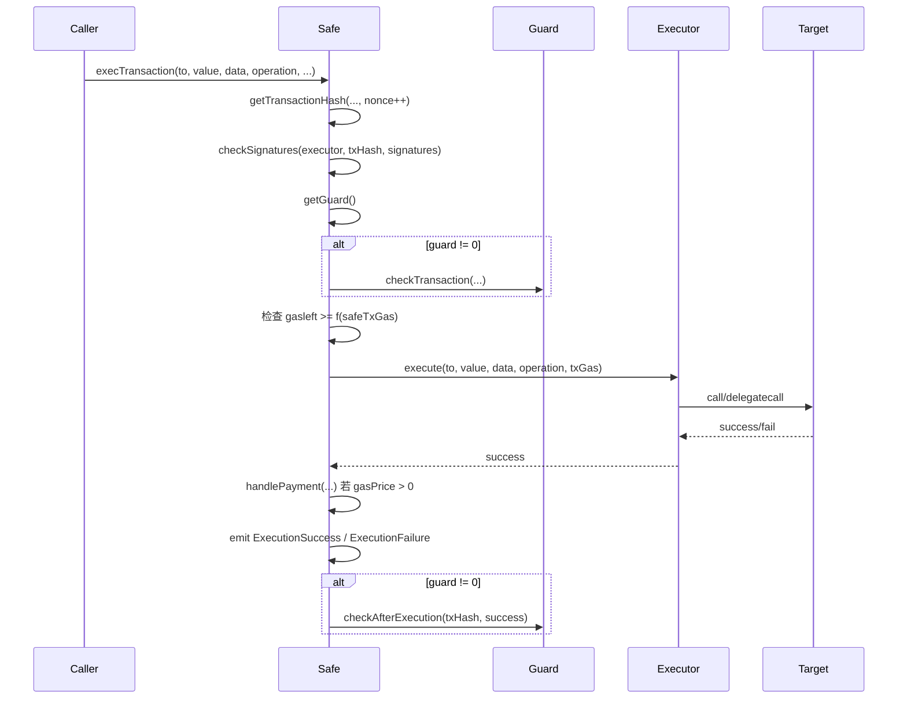
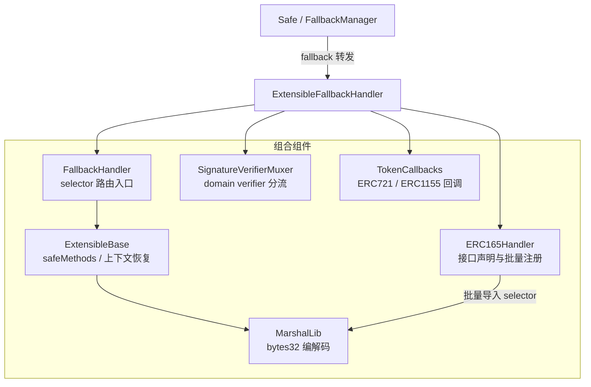
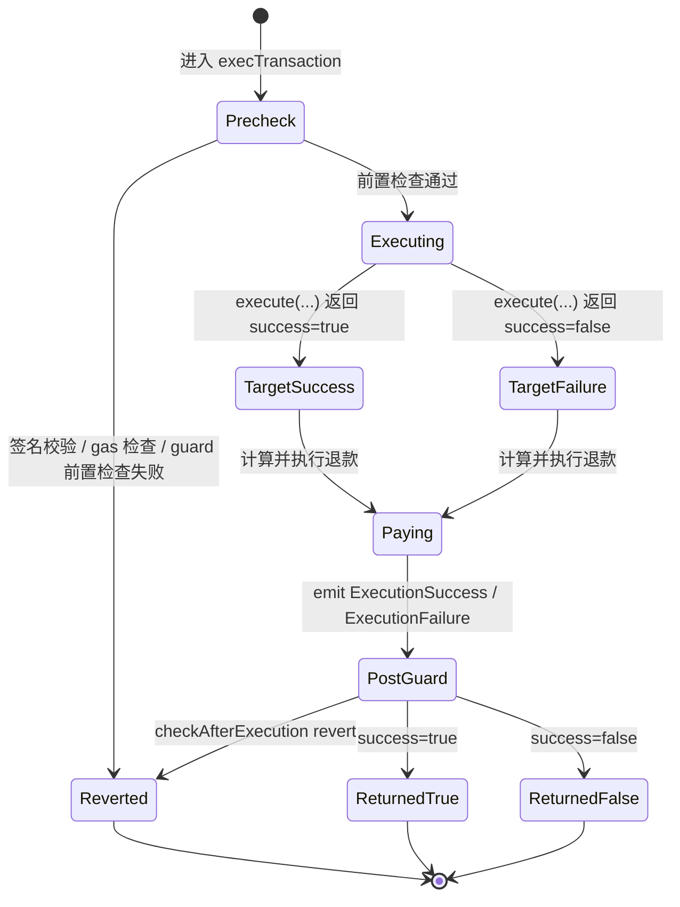

# Safe Smart Account 源码分析报告

## 1. 概述

**Safe Smart Account**（原 Gnosis Safe）是一套非托管的智能合约协议，用于创建可编程的多签账户。交易需经多个所有者（owners）授权才能执行，相比普通 EOA 提供更高安全性与资金保护。当前仓库版本为 **v1.5.0**，合约采用 Solidity 0.7.6，构建系统为 Hardhat。

本报告对项目进行系统性源码分析，涵盖架构、核心流程、数据结构、调用链与数据流。

---

## 2. 项目结构概览

### 2.1 目录与模块

| 目录/文件 | 职责 |
|-----------|------|
| `contracts/Safe.sol` | 主实现：多签核心逻辑（L1 版，基础事件更少，不发完整交易参数事件） |
| `contracts/SafeL2.sol` | L2 版 Safe，继承 Safe 并增加交易/模块执行事件 |
| `contracts/base/` | 基础能力：OwnerManager、ModuleManager、GuardManager、FallbackManager、Executor |
| `contracts/common/` | 通用组件：Singleton、SelfAuthorized、签名解码、EIP 扩展等 |
| `contracts/proxies/` | SafeProxy（委托调用实现）、SafeProxyFactory（CREATE2 工厂） |
| `contracts/handler/` | Fallback 处理器（Compatibility / Extensible）及 HandlerContext |
| `contracts/libraries/` | MultiSend、CreateCall、SignMessageLib、SafeMigration、SafeStorage 等 |
| `contracts/interfaces/` | ISafe、IModuleManager、IGuardManager、Enum 等接口定义 |
| `contracts/accessors/` | SimulateTxAccessor（模拟执行） |
| `src/` | TypeScript 部署脚本与工具（deploy_*、utils） |
| `test/` | Hardhat 测试；`certora/` 为形式化验证配置与规格 |
| `docs/TeachingSafe-教学版说明.md` | 教学说明文档，用于辅助理解 Safe 核心机制 |

### 2.2 技术栈

- **语言**: Solidity ≥0.7.0 <0.9.0（主合约固定 0.7.6 以保证字节码稳定与部署确定性）
- **构建**: Hardhat 2.x，solc 0.7.6
- **脚本**: TypeScript（部署、任务、工具函数）
- **验证**: Certora 规格与配置

---

## 3. 架构概览

### 3.0 总体架构图

下图从分层与合约职责角度概括 Safe Smart Account 的整体架构：自上而下为入口层、代理层、核心实现层、基础能力层与扩展层；实线表示调用/委托关系，虚线表示可选或按需绑定。



**图 1：分层架构** — 入口层创建/调用；代理层转发；核心实现层承载多签与执行；基础能力层提供 owners、modules、guards、fallback、执行；扩展层为可选 Handler / Guard / Module。

### 3.1 模块关系图



### 3.2 代理与实现关系



- **SafeProxy**：仅保存 `singleton`（实现地址），所有调用通过 `delegatecall` 转发到实现。
- **Singleton**：实现合约（Safe/SafeL2）中第一个状态变量为 `singleton`，与 Proxy 的 storage slot 0 对齐，作用是保证 `delegatecall` 场景下的存储布局一致。
- **初始化保护**：实现合约自身不会被当作钱包使用，真正原因是 `Safe` 构造函数先将 `threshold` 设为 `1`，后续若直接对 singleton 调用 `setup()`，`setupOwners()` 会因“已初始化”而回滚。

### 3.3 Safe 继承与组合

```
Safe / SafeL2
├── Singleton
├── NativeCurrencyPaymentFallback
├── ModuleManager (→ Executor)
├── GuardManager
├── OwnerManager (→ EIP7702)
├── SignatureDecoder
├── SecuredTokenTransfer
├── ISignatureValidatorConstants
├── FallbackManager
├── StorageAccessible
├── EIP7951
└── ISafe
```

### 3.4 核心类 UML 类图

下图从“代理层 -> 实现层 -> 基础能力层 -> 扩展层”角度，用 UML 类图方式展示当前仓库的核心类关系：

```mermaid
classDiagram
    class SafeProxyFactory {
        +createProxyWithNonce(_singleton, initializer, saltNonce)
        +createProxyWithNonceL2(_singleton, initializer, saltNonce)
        +createChainSpecificProxyWithNonce(_singleton, initializer, saltNonce)
        +createChainSpecificProxyWithNonceL2(_singleton, initializer, saltNonce)
    }

    class SafeProxy {
        -singleton : address
        +fallback()
    }

    class Safe {
        +setup(_owners, _threshold, to, data, fallbackHandler, paymentToken, payment, paymentReceiver)
        +execTransaction(to, value, data, operation, safeTxGas, baseGas, gasPrice, gasToken, refundReceiver, signatures)
        +checkSignatures(executor, dataHash, signatures)
        +checkNSignatures(executor, dataHash, signatures, requiredSignatures)
        +approveHash(hashToApprove)
        +getTransactionHash(...)
        +domainSeparator()
    }

    class SafeL2 {
        +onBeforeExecTransaction(...)
        +onBeforeExecTransactionFromModule(...)
    }

    class Singleton
    class OwnerManager {
        +addOwnerWithThreshold(owner, threshold)
        +removeOwner(prevOwner, owner, threshold)
        +swapOwner(prevOwner, oldOwner, newOwner)
        +changeThreshold(threshold)
    }
    class ModuleManager {
        +enableModule(module)
        +disableModule(prevModule, module)
        +execTransactionFromModule(to, value, data, operation)
        +execTransactionFromModuleReturnData(to, value, data, operation)
        +setModuleGuard(moduleGuard)
    }
    class GuardManager {
        +setGuard(guard)
    }
    class FallbackManager {
        +setFallbackHandler(handler)
        +fallback()
    }
    class Executor {
        #execute(to, value, data, operation, txGas)
    }
    class StorageAccessible {
        +getStorageAt(offset, length)
        +simulateAndRevert(targetContract, calldataPayload)
    }
    class EIP7702
    class EIP7951

    class CompatibilityFallbackHandler {
        +isValidSignature(_dataHash, _signature)
        +simulate(targetContract, calldataPayload)
        +encodeTransactionData(...)
    }

    class ExtensibleFallbackHandler
    class FallbackHandler {
        +setSafeMethod(selector, newMethod)
        +fallback(data)
    }
    class ExtensibleBase {
        +safeMethods : mapping
    }
    class SignatureVerifierMuxer {
        +setDomainVerifier(domainSeparator, verifier)
        +isValidSignature(_hash, signature)
    }
    class ERC165Handler {
        +setSupportedInterface(interfaceId, supported)
        +addSupportedInterfaceBatch(interfaceId, handlerWithSelectors)
        +removeSupportedInterfaceBatch(interfaceId, selectors)
    }
    class TokenCallbacks

    Singleton <|-- Safe
    OwnerManager <|-- Safe
    ModuleManager <|-- Safe
    GuardManager <|-- Safe
    FallbackManager <|-- Safe
    StorageAccessible <|-- Safe
    EIP7951 <|-- Safe
    EIP7702 <|-- OwnerManager
    Executor <|-- ModuleManager
    Safe <|-- SafeL2

    FallbackHandler <|-- ExtensibleFallbackHandler
    SignatureVerifierMuxer <|-- ExtensibleFallbackHandler
    TokenCallbacks <|-- ExtensibleFallbackHandler
    ERC165Handler <|-- ExtensibleFallbackHandler
    ExtensibleBase <|-- FallbackHandler
    ExtensibleBase <|-- SignatureVerifierMuxer
    ExtensibleBase <|-- ERC165Handler
    ExtensibleBase <|-- TokenCallbacks

    SafeProxyFactory --> SafeProxy : deploys
    SafeProxy ..> Safe : delegatecall to singleton
    Safe --> CompatibilityFallbackHandler : can set as fallback handler
    Safe --> ExtensibleFallbackHandler : can set as fallback handler
    FallbackManager --> CompatibilityFallbackHandler : forwards unknown calls
    FallbackManager --> ExtensibleFallbackHandler : forwards unknown calls
```



读图时可抓住 4 个重点：

- `SafeProxyFactory -> SafeProxy -> Safe/SafeL2` 是部署与执行主链路，`SafeProxy` 自身几乎不承载业务逻辑。
- `Safe` 通过多重继承拼装出 owner、module、guard、fallback、storage access、P-256 验签等能力。
- `SafeL2` 不是一套独立实现，而是在 `Safe` 之上补充事件发射钩子。
- fallback 体系分为两条主线：`CompatibilityFallbackHandler` 偏兼容接口；`ExtensibleFallbackHandler` 偏可扩展路由。

---

## 4. 核心流程

### 4.1 部署 Safe 账户



- 每个 Safe 实例 = 一个 **SafeProxy**，其 `singleton` 指向统一的 Safe 或 SafeL2 实现。
- 初始化只做一次：`setup()` 内通过 `setupOwners` 的 `threshold > 0` 检查防止重复调用；未初始化的 Proxy 若被任何人调用 `setup` 会成为其控制的 Safe，因此必须由工厂或可信方在创建后立即传入正确 `initializer`。

### 4.1.1 工厂部署与初始化细节

`SafeProxyFactory.createProxyWithNonce(_singleton, initializer, saltNonce)` 的关键点不只是 `CREATE2`，还包括“地址如何与初始化参数绑定”以及“为什么能原子化完成 setup”：

- 工厂先计算 `salt = keccak256(keccak256(initializer), saltNonce)`；因此 **initializer 变化会导致 proxy 地址变化**。
- `deployProxy` 使用 `type(SafeProxy).creationCode + singleton` 作为部署字节码，通过 `create2` 生成新 proxy。
- 若 `initializer.length > 0`，工厂会立即对新 proxy 执行一次 `call(initializer)`；在大多数场景下，这个 `initializer` 就是 `Safe.setup(...)` 的 calldata。
- 若初始化调用失败，工厂会把 revert data 原样向上抛出，因此整个“创建 + 初始化”是原子操作，不会留下“已创建但未正确 setup”的半成品。



### 4.2 执行交易（execTransaction）



**要点：**

1. **交易哈希**：EIP-712 结构化数据哈希，包含 to、value、data、operation、safeTxGas、baseGas、gasPrice、gasToken、refundReceiver、**nonce**；nonce 在计算哈希后自增，防重放。
2. **签名校验**：`checkSignatures` / `checkNSignatures` 要求至少 `threshold` 个有效签名，支持 ECDSA（v=27/28）、eth_sign（v>30，即真实 v+4）、EIP-1271 合约签名（v=0）、approved hash（v=1）、secp256r1（v=2，EIP-7951/RIP-7212）。
3. **Transaction Guard**：若设置了 Guard，先 `checkTransaction`，执行后再 `checkAfterExecution`；Guard 不能修改交易参数，但可以在执行前阻止交易，或在执行后通过 `revert` 回滚整笔 Safe 交易，因此会影响最终结果。
4. **执行**：通过 `Executor.execute` 做 `CALL` 或 `DELEGATECALL`，不检查 `to` 是否有代码，由调用方保证。
5. **Gas 退款**：按 `gasUsed + baseGas`、`gasPrice`、`gasToken` 计算并转给 `refundReceiver`（0 则 tx.origin）；若内部目标调用失败但外层 Safe 交易未 revert，退款仍会发生；若整笔 `execTransaction` 最终 revert，则退款也会回滚。

### 4.2.1 失败与回滚语义

- **签名或前置检查失败**：若 `checkSignatures`、`Guard.checkTransaction`、gas 充足性检查等任一步骤失败，`execTransaction` 会直接 `revert`，内部目标调用与退款都不会发生。
- **内部目标调用失败**：`Executor.execute` 的目标调用失败时，Safe 不一定立即 `revert`，而是将结果记为 `success = false`；只要后续逻辑未回滚，`handlePayment` 与 `ExecutionFailure` 事件仍可能发生。
- **后置 Guard 失败**：若 `checkAfterExecution(txHash, success)` 回滚，则此前的内部调用效果、退款、事件都会随整笔 Safe 交易一起回滚；因此它拥有“最终否决权”。
- **模块执行同理**：`execTransactionFromModule*` 也分为“目标调用失败但外层未回滚”和“Guard 后置检查导致整笔回滚”两层语义，只是它不走多签校验，而是依赖模块启用状态与 Module Guard。

### 4.3 交易执行调用链（树形）

```
execTransaction()                          // Safe.sol
├── onBeforeExecTransaction()              // 钩子；SafeL2 在此 emit SafeMultiSigTransaction
├── getTransactionHash(...)               // 使用当前 nonce，随后 nonce++
├── checkSignatures(msg.sender, txHash, signatures)
│   └── checkNSignatures(..., threshold)
│       ├── signatureSplit(signatures, i)  // 取 v,r,s 或动态数据指针
│       ├── [v==0] checkContractSignature(owner, dataHash, signatures, offset) → EIP-1271
│       ├── [v==1] approvedHashes[owner][dataHash] 检查
│       ├── [v==2] p256Verify(...)         // secp256r1
│       └── [else] ecrecover(dataHash 或 EIP-191 hash, v, r, s)
├── getGuard()                             // GuardManager，读 GUARD_STORAGE_SLOT
├── ITransactionGuard(guard).checkTransaction(...)
├── execute(to, value, data, operation, txGas)  // Executor
│   └── call / delegatecall  assembly
├── handlePayment(gasUsed, baseGas, gasPrice, gasToken, refundReceiver)
│   └── 原生币：receiver.call{value: payment}；ERC20：transferToken
├── emit ExecutionSuccess / ExecutionFailure
└── ITransactionGuard(guard).checkAfterExecution(txHash, success)
```

### 4.4 模块执行（execTransactionFromModule）

- 仅允许已启用模块调用：`msg.sender != SENTINEL_MODULES && modules[msg.sender] != address(0)`（排除哨兵地址 0x1，因为 `modules[SENTINEL]` 始终非零）。
- 可选 **Module Guard**：`checkModuleTransaction` → 执行 → `checkAfterModuleExecution`。
- 使用 `Executor.execute`，gas 传 `type(uint256).max`，不限制 Safe 侧 gas。
- `execTransactionFromModuleReturnData` 在同样逻辑上把 `returndata` 拷贝并返回。

### 4.5 Fallback 与 Handler

- 未匹配到函数时进入 `FallbackManager.fallback()`，从 `FALLBACK_HANDLER_STORAGE_SLOT` 读取 handler，将 **calldata + msg.sender（20 字节）** 拼在一起再 `call(handler)`。注意：此 `call` 的 **value 为 0**，即随 fallback 发送给 Safe 的 ETH 不会被转发到 handler。
- Handler 常用于：ERC-1271 验签、ERC-721/1155 回调、EIP-165 等，与核心多签逻辑解耦。
- 当前源码里有两条 handler 线路：`CompatibilityFallbackHandler` 兼容旧接口并包含 ERC-777 回调；`ExtensibleFallbackHandler` 走可扩展路由，聚焦 ERC-1271、ERC-721/1155、EIP-165 与自定义 fallback 方法。
- 禁止将 handler 设为 `address(this)`，避免通过短 calldata + 精心构造的 sender 拼出 4 字节 selector 调用到 Safe 内部方法。

### 4.5.1 Extensible Fallback Handler 机制

`ExtensibleFallbackHandler` 由多个可组合组件构成：

- `FallbackHandler`：提供通用 fallback 入口；按 `msg.sig` 查找当前 Safe 对应的 method handler。
- `ExtensibleBase`：维护 `safeMethods[safe][selector]` 路由表，并通过 `HandlerContext` 恢复原始调用者。
- `MarshalLib`：将 handler 元数据压成一个 `bytes32`。其中最高字节表示是否为 static 方法，低 20 字节保存 handler 地址；批量导入接口时还可额外编码 selector。
- `SignatureVerifierMuxer`：为不同 `domainSeparator` 绑定不同 verifier。其 `isValidSignature` 会先尝试“域路由 verifier”，失败后再回退到 Safe 默认 ERC-1271 验签。
- `ERC165Handler`：支持为某个 interfaceId 批量注册 selector -> handler 路由，并用 selector 的 XOR 校验 interfaceId 是否正确。
- `TokenCallbacks`：提供 ERC-721 / ERC-1155 回调魔术值。

可将调用链概括为：

```text
Safe.fallback()
  -> FallbackManager 读取 handler
  -> calldata 末尾追加 caller(20 bytes)
  -> ExtensibleFallbackHandler.fallback()
  -> 读取 safeMethods[safe][msg.sig]
  -> 根据 isStatic 选择 IStaticFallbackMethod / IFallbackMethod
  -> 传入 (safe, originalSender, value=0, strippedData)
```

这种设计的关键点在于：**路由是按 Safe 隔离的**。即便多个 Safe 共用同一个 `ExtensibleFallbackHandler` 实例，它们的 selector 配置、domain verifier 配置也互不影响。

下图展示 `ExtensibleFallbackHandler` 内部各组件的组合关系与主要职责：



---

## 5. 关键数据结构与存储

### 5.1 存储布局（与 SafeStorage 一致）

| 用途 | 存储位置 / 常量 | 说明 |
|------|------------------|------|
| 实现地址 | slot 0 (`singleton`) | Proxy 与 Singleton 共用，必须为首个变量 |
| 模块链表 | `modules` mapping | SENTINEL_MODULES = 0x1，modules[module] = next |
| 所有者链表 | `owners` mapping | SENTINEL_OWNERS = 0x1，owners[owner] = next |
| 所有者数量 | `ownerCount` | |
| 阈值 | `threshold` | 所需签名数 |
| 交易 nonce | `nonce` | 每次 execTransaction 用后自增 |
| 弃用 domain separator | `_deprecatedDomainSeparator` | 保留以兼容布局 |
| 已签消息 | `signedMessages` mapping | 消息哈希 → 1 表示已全签 |
| 已批准哈希 | `approvedHashes[owner][hash]` | 用于 v=1 签名 |
| Fallback Handler | `FALLBACK_HANDLER_STORAGE_SLOT` | keccak256("fallback_manager.handler.address") |
| Transaction Guard | `GUARD_STORAGE_SLOT` | keccak256("guard_manager.guard.address") |
| Module Guard | `MODULE_GUARD_STORAGE_SLOT` | keccak256("module_manager.module_guard.address") |

### 5.2 EIP-712 与交易哈希

- **Domain**: `EIP712Domain(uint256 chainId, address verifyingContract)`，防止跨链/跨 Safe 重放。
- **SafeTx 类型**:  
  `SafeTx(address to, uint256 value, bytes data, uint8 operation, uint256 safeTxGas, uint256 baseGas, uint256 gasPrice, address gasToken, address refundReceiver, uint256 nonce)`
- **getTransactionHash**：先取 `domainSeparator()`，再对上述类型与参数做 EIP-712 编码并 keccak256。

### 5.3 所有者 / 模块链表

- 使用 **链表 + mapping**：`owners[SENTINEL_OWNERS]` 为第一个 owner，`owners[last] = SENTINEL_OWNERS`；模块同理。
- 增删改均为 O(1)，且便于做“prev + current”校验（如 `removeOwner(prevOwner, owner, _threshold)`）。

### 5.4 签名与账户兼容扩展

- **EIP-7951 / RIP-7212（P-256）**：Safe 在 `v = 2` 的签名分支中调用 `address(0x100)` 预编译验证 secp256r1（P-256）签名。若底层链不支持该预编译，这一路径天然不可用，但不会影响普通 secp256k1 签名。
- **EIP-7702**：`OwnerManager` 继承 `EIP7702`，用于检测当前执行是否处于 delegated account 上下文。在特定 7702 场景下，Safe 自身地址可作为 owner 被接受；这属于对新账户模型的兼容，而非传统多签路径的常规配置。

### 5.4.1 `checkNSignatures` 签名分流图

`checkNSignatures` 是 Safe 多签验证的核心枢纽。它逐条读取 `signatures` 中的 65 字节静态头部，并按 `v` 值决定后续验证路径：

```mermaid
flowchart TD
    A[读取一条签名的 v r s] --> B{v 值}
    B -->|0| C[合约签名 EIP-1271]
    B -->|1| D[approved hash]
    B -->|2| E[P-256 / secp256r1]
    B -->|27/28| F[标准 ECDSA]
    B -->|>30| G[eth_sign / personal_sign]

    C --> C1[r 中取 owner 地址]
    C1 --> C2[s 作为动态偏移]
    C2 --> C3[调用 owner.isValidSignature]

    D --> D1[r 中取 owner 地址]
    D1 --> D2{executor == owner 或<br/>approvedHashes[owner][hash] != 0}

    E --> E1[r 中取声明 owner]
    E1 --> E2[s 指向动态区<br/>读取 sig_r sig_s qx qy]
    E2 --> E3[由 qx qy 派生地址]
    E3 --> E4[p256Verify]

    F --> F1[ecrecover(dataHash)]
    G --> G1[ecrecover(EIP-191 前缀哈希)]

    C3 --> H[owner 合法性与严格升序检查]
    D2 --> H
    E4 --> H
    F1 --> H
    G1 --> H
    H --> I[继续下一条签名]
```

补充理解要点：

- `v = 0` 和 `v = 2` 都会把动态签名内容放在静态区之后，并通过 `s` 作为偏移去读取。
- `v = 1` 的 approved hash 路径允许 `executor == owner` 时“隐式批准”，因此旧兼容接口如果直接用 `msg.sender` 作为 executor，会有等效降低阈值 1 的语义风险。
- 每验证完一个 owner，Safe 都会要求其地址 **严格大于** 上一个 owner，借此同时完成“去重”和“地址递增排序”校验。

---

## 6. 数据流：从交易参数到执行与退款

```
数据流: execTransaction 入参 → 执行与支付
────────────────────────────────────────────
入口: execTransaction(to, value, data, operation, safeTxGas, baseGas, gasPrice, gasToken, refundReceiver, signatures)
  │
  ▼ getTransactionHash(..., nonce++)  @ Safe.sol
  │  输入: 上述参数 + 当前 nonce
  │  输出: bytes32 txHash (EIP-712)
  │
  ▼ checkSignatures(executor, txHash, signatures)
  │  校验: 至少 threshold 个合法签名；owner 不重复、递增
  │
  ▼ getGuard() → address guard
  │
  ▼ [guard] checkTransaction(...)  @ ITransactionGuard
  │
  ▼ execute(to, value, data, operation, txGas)  @ Executor
  │  输入: to, value, data, operation, txGas
  │  输出: success (bool)
  │
  ▼ gasUsed = gasleft() 前后差值
  ▼ payment = (gasUsed + baseGas) * min(gasPrice, tx.gasprice) [原生币] 或 (gasUsed + baseGas) * gasPrice [ERC20]
  ▼ handlePayment(...) → 向 refundReceiver（或 tx.origin）支付 payment
  │
  ▼ emit ExecutionSuccess(txHash, payment) / ExecutionFailure(txHash, payment)
  │
  ▼ [guard] checkAfterExecution(txHash, success)
  │
  出口: return success
```

### 6.1 `execTransaction` 结果状态图

下图把 Safe 交易最容易混淆的 3 类结果拆开：前置检查失败、内部目标调用失败、以及后置 Guard 否决。



- `ReturnedFalse` 表示 Safe 外层调用**成功返回**，但内部目标调用失败。
- 只有走到 `Reverted` 的路径，内部调用效果、退款与事件才会整体回滚。

### 6.2 模拟执行：StorageAccessible 与 SimulateTxAccessor

- `StorageAccessible.getStorageAt(offset, length)` 允许按 slot 读取 Safe storage，常用于读取固定 slot 中的 Guard / fallback handler 等配置。
- `StorageAccessible.simulateAndRevert(target, calldata)` 通过 `delegatecall` 在 Safe 上下文中执行目标逻辑，但不会正常返回，而是把 `success + returndata` 编码进 revert 数据再回滚。
- `SimulateTxAccessor` 是专门给 `simulateAndRevert` 搭配使用的辅助合约：它内部复用 `Executor.execute` 执行一次 `(to, value, data, operation)`，并返回 `estimate`、`success` 与 `returnData`。
- 这条路径的意义是：**在不提交真实交易的情况下，用 Safe 的真实 storage 上下文预演一次调用**，便于前端、SDK 或调试工具做 gas 估算与结果预检查。

### 6.3 SafeToL2Setup、MultiSend 与 MultiSendCallOnly

- `SafeToL2Setup` 用于“跨网络同地址部署”场景：默认先部署指向 `Safe` 的 proxy，再在 setup 阶段通过 `delegatecall` 调用 `setupToL2(l2Singleton)`；若当前链 `chainId != 1`，则把 `singleton` 切换到 `SafeL2`。它要求：
  - 必须通过 `delegatecall` 调用；
  - Safe 尚未执行过交易（`nonce == 0`）；
  - 传入的 `l2Singleton` 必须是合约地址。
- `MultiSend` 支持在一次打包调用中混合执行 `CALL` 与 `DELEGATECALL`，能力更强，但也意味着更高的组合风险。
- `MultiSendCallOnly` 与 `MultiSend` 编码兼容，但显式禁止 `operation = 1`（`DELEGATECALL`）；若打包数据中出现 `DELEGATECALL` 会直接回滚。它适合只希望做外部调用、不希望批量载荷获得 Safe 上下文写权限的场景。

---

## 7. 权限与自授权

- **authorized**（SelfAuthorized）：要求 `msg.sender == address(this)`，即只能通过 Safe 自身的一次调用（即通过 `execTransaction` 或 `execTransactionFromModule` 触发的调用链）来执行。
- 因此：修改 owners、threshold、modules、guards、fallback handler 等操作，都必须先打包成 Safe 交易或模块交易，经多签或模块执行后再调这些方法，从而保证“只有 Safe 自己授权自己”。

### 7.1 模块 / Guard / Fallback 权限风险矩阵

| 组件 | 挂载方式 | 触发时机 | 能否主动发起调用 | 能否阻止交易 | 对 Safe 存储/权限面的影响 | 主要风险 | 审计重点 |
|------|----------|----------|------------------|--------------|---------------------------|----------|----------|
| `Module` | `enableModule()` 挂到模块链表 | 由模块自己调用 `execTransactionFromModule*` 时 | 可以。模块可直接让 Safe 执行任意 `CALL/DELEGATECALL` | 间接可以。模块本身可选择不发起，且受 Module Guard 约束 | **最高**。本质上获得接近 Safe 自身的执行权限 | 恶意模块可转走资产、改配置、执行任意 delegatecall | 模块来源可信度、可升级性、是否可重入、是否滥用 delegatecall、是否绕过预期策略 |
| `Transaction Guard` | `setGuard()` 存到 `GUARD_STORAGE_SLOT` | 每次 `execTransaction()` 前后 | 不可以主动发起 Safe 交易，但可在 hook 中执行自身逻辑 | **可以**。前置 `checkTransaction` 或后置 `checkAfterExecution` 都可回滚整笔交易 | 对 Safe 主流程有强约束力，但不直接获得模块那样的主动执行入口 | 守卫逻辑写错会造成永久 DoS；后置回滚会连同执行结果与退款一起撤销 | 是否严格校验输入、是否有状态膨胀/死锁风险、是否可能无意中拒绝合法交易 |
| `Module Guard` | `setModuleGuard()` 存到 `MODULE_GUARD_STORAGE_SLOT` | 每次 `execTransactionFromModule*()` 前后 | 不可以主动发起模块交易，但可约束模块执行 | **可以**。可阻止或回滚模块发起的交易 | 只作用于模块路径，不影响普通多签交易路径 | 若规则失当，可能让模块路径失效，或遗漏关键限制 | 是否覆盖模块特有风险、是否正确处理 `success=false`、是否可能被模块组合绕过 |
| `Fallback Handler` | `setFallbackHandler()` 存到 `FALLBACK_HANDLER_STORAGE_SLOT` | Safe 未匹配函数选择器时 | 不能像模块那样主动调用 Safe 主入口，但可响应外部发来的 fallback 调用 | 不属于“审批交易”的阻止器；它决定 fallback 调用如何处理/是否 revert | 取决于 handler 设计。若 handler 支持状态修改或存在自定义路由，权限面可很大 | 错误 handler 可能暴露额外入口、误解析拼接 calldata、引入未预期状态变更 | 是否依赖 `HandlerContext` 正确取 caller、是否限制可写路径、是否存在 selector 混淆/短 calldata 风险 |

可将风险强度粗略理解为：

- **Module**：执行权限最强，风险最高。
- **Transaction Guard / Module Guard**：更像“策略防火墙”，主要风险是误阻断、死锁或逻辑绕过。
- **Fallback Handler**：风险取决于实现复杂度；简单回调型 handler 风险较低，带自定义路由和状态写入的 extensible handler 风险更高。

---

## 8. Safe 与 SafeL2 差异

| 项目 | Safe (L1) | SafeL2 |
|------|-----------|--------|
| 事件 | 仅必要事件（如 ExecutionSuccess/Failure），不包含完整交易参数 | 在 `onBeforeExecTransaction` 中 emit **SafeMultiSigTransaction**（含完整交易参数与 additionalInfo：nonce, msg.sender, threshold） |
| 模块执行 | 无额外事件 | 在 `onBeforeExecTransactionFromModule` 中 emit **SafeModuleTransaction** |
| 使用场景 | 省 Gas，依赖链上 tracing 索引 | L2 或需要链上事件索引的场景 |

逻辑与存储完全一致，SafeL2 仅增加上述事件发射。

---

## 9. 错误码与安全要点

### 9.1 常见错误码索引

| 错误码 | 典型触发位置 | 含义 |
|--------|--------------|------|
| `GS000` | `ModuleManager.setupModules` | setup 阶段对初始化模块的 `delegatecall` 执行失败 |
| `GS001` | `Safe.checkSignatures` | Safe 尚未初始化，`threshold == 0` |
| `GS002` | `ModuleManager.setupModules` | setup 传入的 `to` 不是合约地址 |
| `GS010` | `Safe.execTransaction` | 剩余 gas 不足，无法安全完成执行、事件与 1/64 gas 规则余量 |
| `GS011` | `Safe.handlePayment` | 原生币退款失败 |
| `GS012` | `Safe.handlePayment` | ERC20 退款失败 |
| `GS020` | `Safe.checkNSignatures` | 签名总长度小于 `requiredSignatures * 65` |
| `GS021` | `Safe.checkNSignatures` | 动态签名偏移指向静态区，签名布局非法 |
| `GS022` | `Safe.checkContractSignature` | 合约签名偏移读取越界 |
| `GS023` | `Safe.checkContractSignature` | 合约签名动态数据越界 |
| `GS024` | `Safe.checkContractSignature` | EIP-1271 合约签名未返回正确 magic value |
| `GS025` | `Safe.checkNSignatures` | approved hash 未设置，且 executor 不是对应 owner |
| `GS026` | `Safe.checkNSignatures` | owner 非法、重复、未排序或不在 owner 链表中 |
| `GS027` | `Safe.checkNSignatures` | P-256 动态签名数据越界 |
| `GS028` | `Safe.checkNSignatures` | P-256 公钥派生地址不匹配或预编译验签失败 |
| `GS030` | `Safe.approveHash` | 非 owner 调用了 `approveHash` |
| `GS031` | `SelfAuthorized.authorized` | 非自调用却调用了仅允许 Safe 自身触发的方法 |
| `GS100` | `ModuleManager.setupModules` | 模块存储已初始化，重复 setup |
| `GS101` | `ModuleManager.enable/disableModule` | 模块地址为 `0` 或哨兵地址 |
| `GS102` | `ModuleManager.enableModule` | 模块重复添加 |
| `GS103` | `ModuleManager.disableModule` | `prevModule` 与 `module` 链表关系不匹配 |
| `GS104` | `ModuleManager.preModuleExecution` | 调用者不是已启用模块 |
| `GS105` | `ModuleManager.getModulesPaginated` | 分页起点非法 |
| `GS106` | `ModuleManager.getModulesPaginated` | `pageSize == 0` |
| `GS200` | `OwnerManager.setupOwners` | owner/threshold 已初始化，重复 setup |
| `GS201` | `OwnerManager.setupOwners/changeThreshold/removeOwner` | threshold 大于 owner 数量 |
| `GS202` | `OwnerManager.setupOwners/changeThreshold` | threshold 不能为 0 |
| `GS203` | `OwnerManager.requireIsValidOwner`（由 `requireCanAddOwner` / `requireCanRemoveOwner` 调用） | owner 地址非法（如 0、哨兵、非允许场景下的 self） |
| `GS204` | `OwnerManager.setupOwners/requireCanAddOwner` | owner 重复 |
| `GS205` | `OwnerManager.requireCanRemoveOwner`（由 `removeOwner` / `swapOwner` 调用） | `prevOwner` 与待删 owner 链表关系不匹配 |
| `GS300` | `GuardManager.setGuard` | guard 不支持 `ITransactionGuard` 接口 |
| `GS301` | `ModuleManager.setModuleGuard` | module guard 不支持 `IModuleGuard` 接口 |
| `GS400` | `FallbackManager.internalSetFallbackHandler` | fallback handler 被设置为 Safe 自身 |

### 9.2 安全要点

安全要点：  
模块与 Guard 具有高权限（模块可任意调用 `execute`，Guard 可阻止交易），仅应部署并添加经过审计的模块与 Guard；未初始化的 Proxy 任何人可 `setup` 认领；approved hash 永久有效且无撤销接口，需谨慎使用。

---

## 10. 核心函数索引

| 函数 / 入口 | 所在文件 | 作用 |
|------------|----------|------|
| `setup(...)` | `contracts/Safe.sol` | Safe 一次性初始化入口：owners、threshold、fallback handler、modules、可选 payment |
| `execTransaction(...)` | `contracts/Safe.sol` | 多签主入口：计算哈希、验签、guard、执行、退款、事件 |
| `checkSignatures(...)` | `contracts/Safe.sol` | 基于当前 threshold 验证签名集合 |
| `checkNSignatures(...)` | `contracts/Safe.sol` | Safe 核心签名分流器，按 `v` 值选择 ECDSA / EIP-1271 / approved hash / P-256 等路径 |
| `approveHash(...)` | `contracts/Safe.sol` | owner 预批准某个 hash，供 `v = 1` 签名路径使用 |
| `execTransactionFromModule(...)` | `contracts/base/ModuleManager.sol` | 已启用模块以 Safe 身份执行一笔调用 |
| `execTransactionFromModuleReturnData(...)` | `contracts/base/ModuleManager.sol` | 模块执行并回传 `returnData` |
| `setFallbackHandler(...)` | `contracts/base/FallbackManager.sol` | 设置 Safe 的 fallback handler |
| `fallback()` | `contracts/base/FallbackManager.sol` | 未匹配函数时转发到 configured handler，并在 calldata 末尾附加 caller |
| `setSafeMethod(...)` | `contracts/handler/extensible/FallbackHandler.sol` | 为指定 selector 配置 extensible fallback 路由 |
| `setDomainVerifier(...)` | `contracts/handler/extensible/SignatureVerifierMuxer.sol` | 为某个 `domainSeparator` 绑定 verifier |
| `addSupportedInterfaceBatch(...)` | `contracts/handler/extensible/ERC165Handler.sol` | 批量注册 interface 的 selector 路由，并启用 ERC-165 接口声明 |
| `simulateAndRevert(...)` | `contracts/common/StorageAccessible.sol` | 在 Safe 上下文中模拟执行并把结果编码进 revert data |
| `simulate(...)` | `contracts/accessors/SimulateTxAccessor.sol` | 供 `simulateAndRevert` 配合调用的执行器，返回 gas/success/returnData |
| `createProxyWithNonce(...)` | `contracts/proxies/SafeProxyFactory.sol` | 使用 CREATE2 部署 proxy，并可原子化执行 initializer |
| `fallback()` | `contracts/proxies/SafeProxy.sol` | 所有调用统一 `delegatecall` 到 `singleton` |

---

## 11. 建议阅读路径

如果是第一次阅读这个仓库，建议按“先主线、后扩展、再辅助组件”的顺序看：

1. `contracts/proxies/SafeProxy.sol`、`contracts/proxies/SafeProxyFactory.sol`
   先理解 proxy 模式、`CREATE2` 地址生成，以及为什么 `initializer` 会参与地址计算。
2. `contracts/Safe.sol`
   抓住两条主线：`setup()` 初始化与 `execTransaction()` 多签执行。
3. `contracts/base/OwnerManager.sol`、`contracts/base/ModuleManager.sol`、`contracts/base/GuardManager.sol`、`contracts/base/FallbackManager.sol`
   这四个 base 合约分别对应 owner、module、guard、fallback 四个核心扩展面。
4. `contracts/handler/CompatibilityFallbackHandler.sol` 与 `contracts/handler/ExtensibleFallbackHandler.sol`
   对比旧兼容 handler 与新 extensible handler 的职责差异。
5. `contracts/handler/extensible/`
   这一层再深入读 `ExtensibleBase`、`FallbackHandler`、`SignatureVerifierMuxer`、`ERC165Handler`、`MarshalLib`，理解可扩展 fallback 的内部路由机制。
6. `contracts/libraries/` 与 `contracts/accessors/`
   最后再看 `MultiSend`、`MultiSendCallOnly`、`SafeToL2Setup`、`SignMessageLib`、`SimulateTxAccessor` 等辅助组件，理解生态使用方式。

## 12. 要点总结

1. **架构**：Proxy（单 slot 存 singleton）+ 单例实现（Safe/SafeL2），通过 delegatecall 复用同一套代码与存储布局；工厂用 CREATE2 + initializer 一次性完成创建与初始化。
2. **多签与签名**：EIP-712 交易哈希 + nonce 防重放；支持 EOA、EIP-1271、approved hash、secp256r1 多种签名方式；阈值与所有者链表管理清晰。
3. **扩展**：Module（可执行任意调用）、Transaction Guard / Module Guard（前后检查）、Fallback Handler（回调与 EIP-1271 等）分层明确；若需版本迁移，通常依赖迁移合约修改 Proxy 的 `singleton`，而不是 Proxy 自带升级入口。
4. **Gas 与支付**：执行后按 gasUsed/baseGas/gasPrice 计算并支付给 refundReceiver，支持原生币与 ERC20；若内部目标调用失败但外层 Safe 交易未 revert，仍会支付退款；若整笔 Safe 交易最终 revert，则付款也会回滚。
5. **版本与兼容**：v1.5.0 固定 Solidity 0.7.6 与存储布局，便于多链部署与确定性地址；SafeL2 在保持兼容前提下增加事件，便于索引与监控。

---

*报告基于当前 main 分支源码整理，若需与某次发布版本严格对应，请以该版本 tag 为准。*
